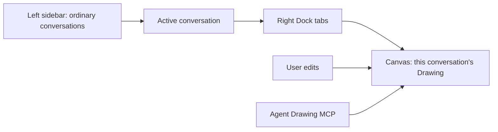
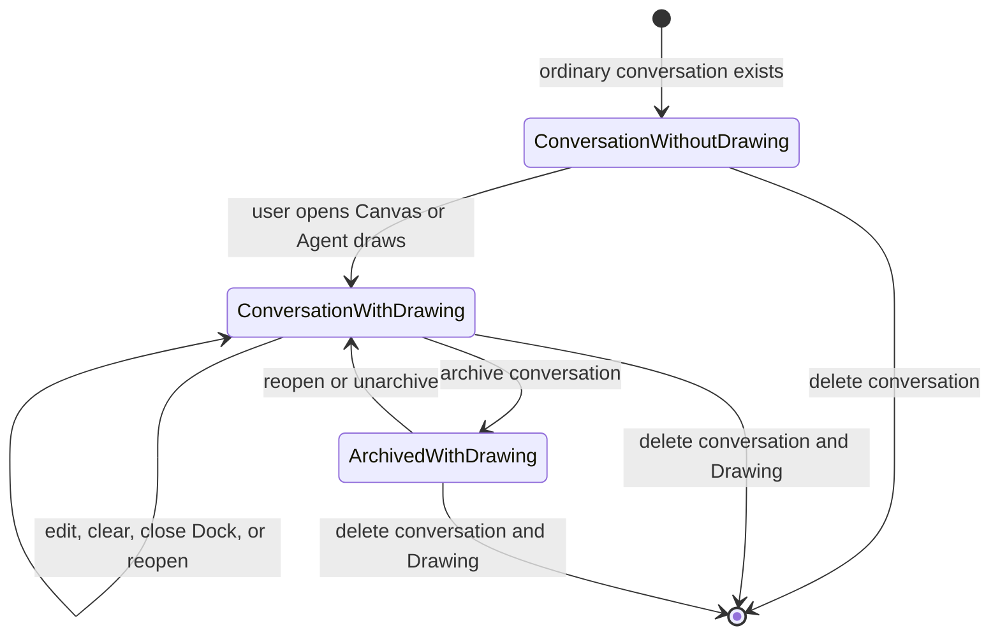
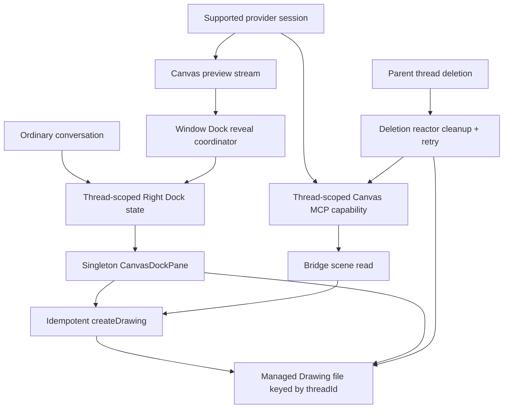
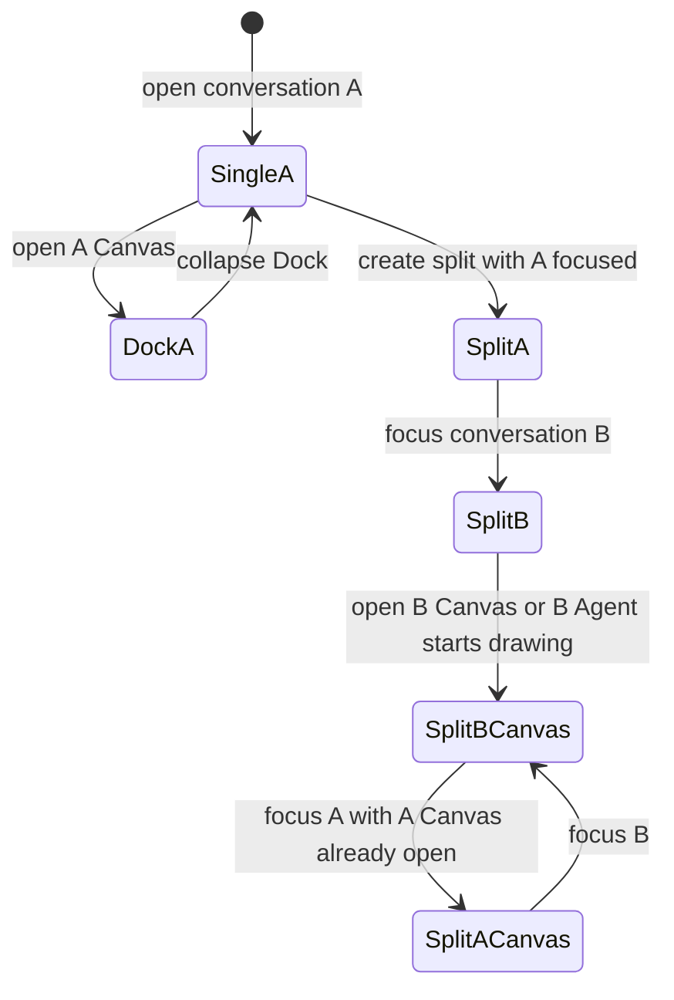
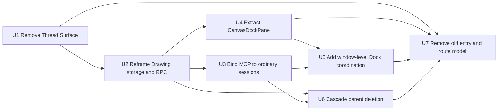

# Session-Scoped Canvas Artifact - Plan

## Goal Capsule

- **Objective:** 将 Canvas 从独立会话类型重构为普通会话中按需创建的单例 Drawing artifact，并把它呈现在该会话的右侧 Dock 中。
- **Product authority:** 本文记录本轮对话中确认的 Canvas 所有权、生命周期、入口、Agent 行为和断代升级决策，并取代旧 AI Canvas Workspace 计划中的独立 Canvas Thread 产品模型。
- **Open blockers:** 无。产品范围已确认，具体数据结构、协议调整和代码迁移顺序留待实现规划。
- **Execution profile:** Deep refactor；按依赖顺序完成领域模型、Drawing 边界、Provider 注入、Dock UI、父级删除和旧模型清理，每个单元同步补齐聚焦测试。
- **Authority order:** Product Contract 高于 Planning Contract；Planning Contract 高于实现便利性；如实现需要恢复独立 Drawing 生命周期、旧数据兼容或扩大 Provider 支持范围，必须停止并重新确认范围。
- **Tail ownership:** 最后一个实现单元负责删除旧入口与死代码、完成跨层回归、运行仓库质量门禁，并确认没有遗留两套 Canvas 产品模型。

---

## Product Contract

### Summary

Studio 和 Project 的普通会话都可以在右侧 Dock 打开 Canvas。
每个会话最多拥有一个按需创建、不可独立删除的 Drawing artifact，用户和 Agent 通过同一 Canvas 与现有 MCP 绘图能力持续协作。

### Problem Frame

当前 Canvas 把 Drawing 建模为专用 Thread，并让 Thread ID 同时承担 Drawing 身份。
这一模型把 Drawing 文件、会话、左侧导航和删除动作绑定为同一生命周期，但产品行为又允许用户分别操作画布和会话，因而产生状态错配和无法归档的幽灵会话。

独立 Canvas Workspace 还要求额外的创建入口、专用路由、会话分类和删除补偿逻辑。
这些机制都源于“Drawing 是一种 Session”的前提，而不是 Canvas 作为会话内 artifact 的真实产品关系。

### Key Decisions

- **Conversation owns Canvas.** Canvas 是普通会话的子资源，不是独立会话。 (session-settled: user-directed — chosen over a dedicated Canvas Session: one parent lifecycle prevents Session and Drawing state from diverging)
- **One lazy Drawing per conversation.** 会话在用户首次打开 Canvas 或 Agent 首次调用绘图能力前不创建 Drawing，创建后始终复用同一 artifact。 (session-settled: user-directed — chosen over eager creation, multiple Drawings, or Drawing history: ordinary conversations should not create unused files)
- **Drawing cannot be deleted independently.** 用户只能清空画布内容并保留 artifact 身份；归档会话保留 Drawing，只有真正删除父会话才删除 Drawing。 (session-settled: user-directed — chosen over independently deleting a Drawing: eliminating the second destructive lifecycle removes mismatch states)
- **Right Dock is the Canvas surface.** Canvas 与 Browser、Diff、Explorer、Terminal 等面板同属普通会话的右侧 Dock，不再拥有顶层 Workspace 或左侧 Drawing 导航。 (session-settled: user-directed — chosen over New Canvas Chat and project-level AI Drawing entry points: Canvas should be reached from its owning conversation)
- **Agent actions reveal the shared Canvas.** Agent 在 Canvas 关闭时调用绘图工具，会打开并激活该会话的 Canvas，新建或加载 Drawing，然后沿用现有 MCP 绘图路径。 (session-settled: user-directed — chosen over a separate agent drawing protocol: user and Agent must operate on the same visible artifact)
- **Clean break from the old model.** 不迁移或兼容旧 Canvas Session 数据，并删除旧模型专用的产品入口、生命周期分支和残留代码。 (session-settled: user-directed — chosen over migration or a compatibility layer: existing local content was intentionally cleared so the model can be replaced outright)

### Actors

- A1. **User:** 在 Studio 或 Project 的普通会话中打开、编辑、清空、隐藏和重新打开 Canvas。
- A2. **Agent:** 根据用户的对话请求调用现有 Drawing MCP 能力，并确保对应 Canvas 对用户可见。
- A3. **Synara:** 维护会话与 Drawing 的所有权、按需创建、持久化、归档和父级删除行为。

### Requirements

**Ownership and lifecycle**

- R1. Studio 和 Project 中的每个普通会话都必须可以拥有零个或一个 Drawing artifact。
- R2. Synara 必须在用户首次打开 Canvas 或 Agent 首次调用 Canvas 绘图能力时才创建 Drawing。
- R3. Drawing 创建后必须在该会话后续的打开、关闭、重启和恢复中保持同一 artifact 身份。
- R4. Synara 不得向用户或 Agent 提供独立删除 Drawing artifact 的能力。
- R5. 用户必须可以清空 Canvas 内容，而清空操作不得更换或删除 Drawing artifact。
- R6. 归档会话必须保留 Drawing，取消归档或重新打开会话后必须加载原 Drawing。
- R7. 真正删除父会话时，Synara 必须同时删除其 Drawing；没有 Drawing 的会话删除行为保持不变。

**Entry and presentation**

- R8. 普通会话的右侧 Dock 必须提供单例 Canvas 面板，并遵循现有 Dock 的打开、激活、切换和关闭交互。
- R9. 关闭右侧 Dock 或切换到其他 Dock 面板只能改变界面状态，不得改变 Drawing 生命周期或内容。
- R10. 切换会话时，Canvas 必须解析为当前会话自己的 Drawing，不能延续或展示上一会话的 Drawing。
- R11. Studio 不得再提供 New Canvas Chat，Project 不得再提供 AI Drawing 创建入口或独立 Drawing 列表。
- R12. Synara 不得再以独立 Canvas Workspace、Canvas Thread 路由或 Canvas 专用会话行呈现 Drawing。

**Agent collaboration**

- R13. Agent 在 Canvas Dock 关闭或其他 Dock 面板处于激活状态时调用绘图能力，Synara 必须打开并激活当前会话的 Canvas。
- R14. Agent 绘图前，Synara 必须为当前会话创建缺失的 Drawing 或加载已经存在的 Drawing。
- R15. Agent 必须继续使用现有 Drawing MCP 能力修改场景，而不是通过新的平行绘图协议或隐藏副本工作。
- R16. Agent 的 Drawing MCP 能力必须限定在当前会话的 Drawing，不能选择或修改其他会话的 Canvas。
- R17. 用户编辑和 Agent MCP 写入必须汇聚到同一持久化场景，并在 Canvas 中显示当前事实状态。

**Old-model removal**

- R18. Canvas 不得再依赖专用 Thread 类型、Canvas 会话创建流程或 Drawing 删除触发会话删除的链路。
- R19. 所有旧 Canvas Session 入口、专用导航、独立删除操作、兼容分支及其只服务旧模型的测试和文档必须被删除或改写。
- R20. 本次变更不提供旧 Canvas Session 或 Drawing 数据的迁移、恢复或兼容保证。

### Workspace Layout



左侧边栏只负责选择普通会话。
Canvas 作为当前会话右侧 Dock 中的一个面板，与其他 Dock 面板共享布局和可见性规则。

### Key Flows

- F1. **User opens Canvas for the first time**
  - **Trigger:** A1 在一个尚无 Drawing 的普通会话中打开 Canvas 面板。
  - **Actors:** A1, A3
  - **Steps:** Synara 为该会话创建 Drawing，打开 Canvas，并显示空白可编辑场景。
  - **Outcome:** 会话从零个 Drawing 变为一个 Drawing，后续打开均复用它。
  - **Covered by:** R1-R3, R8
- F2. **User reopens an existing Canvas**
  - **Trigger:** A1 在已有 Drawing 的会话中打开 Canvas，或从其他 Dock 面板切回 Canvas。
  - **Actors:** A1, A3
  - **Steps:** Synara 加载该会话的现有 Drawing，并恢复其最新持久化内容。
  - **Outcome:** 不创建第二个 Drawing，也不改变 artifact 身份。
  - **Covered by:** R3, R8-R10
- F3. **Agent draws while Canvas is closed**
  - **Trigger:** A2 根据当前对话请求调用 Drawing MCP 能力，而 Canvas Dock 未打开或未激活。
  - **Actors:** A1, A2, A3
  - **Steps:** Synara 打开并激活 Canvas，为当前会话创建或加载 Drawing，然后让现有 MCP 路径读取和修改该场景。
  - **Outcome:** A1 看到 A2 正在修改的同一个 Canvas，结果持久化到当前会话。
  - **Covered by:** R2, R13-R17
- F4. **User clears Canvas**
  - **Trigger:** A1 选择清空当前 Canvas。
  - **Actors:** A1, A3
  - **Steps:** Synara 将场景保存为空内容，同时保留 Drawing artifact 及其会话关联。
  - **Outcome:** 再次打开 Canvas 得到同一个空 Drawing，而不是新建 Drawing。
  - **Covered by:** R3-R5
- F5. **Conversation is archived and restored**
  - **Trigger:** A1 归档一个拥有 Drawing 的会话，随后重新打开或取消归档。
  - **Actors:** A1, A3
  - **Steps:** 归档只改变会话可见性；恢复后 Canvas 加载归档前的 Drawing。
  - **Outcome:** Drawing 内容和身份跨归档保持不变。
  - **Covered by:** R6, R9
- F6. **Conversation is permanently deleted**
  - **Trigger:** A1 真正删除一个拥有 Drawing 的父会话。
  - **Actors:** A1, A3
  - **Steps:** Synara 删除会话及其唯一 Drawing，并清理所有引用该会话的 Canvas 界面状态。
  - **Outcome:** 会话和 Drawing 同时消失，不留下孤立 artifact 或幽灵会话。
  - **Covered by:** R7, R10

### Lifecycle



Canvas 可见性不是生命周期状态。
Drawing 一旦创建，就只随父会话的永久删除而消失。

### Acceptance Examples

- AE1. **Covers R1-R2.** 给定一个从未打开 Canvas 的普通会话，当用户只进行文字对话并关闭应用时，不会产生 Drawing 文件。
- AE2. **Covers R2-R3, R8.** 给定一个没有 Drawing 的会话，当用户首次打开 Canvas 时，只创建一个 Drawing；关闭并重新打开 Canvas 后加载同一个 Drawing。
- AE3. **Covers R4-R5.** 给定一个包含内容的 Canvas，当用户选择清空时，内容变为空，但 Drawing 仍存在且身份不变。
- AE4. **Covers R6.** 给定一个拥有 Drawing 的会话，当用户归档再恢复该会话时，Canvas 显示归档前的内容。
- AE5. **Covers R7.** 给定一个拥有 Drawing 的会话，当用户永久删除会话时，会话和 Drawing 都被删除，侧边栏和 Dock 不保留可重新打开的条目。
- AE6. **Covers R13-R17.** 给定 Canvas Dock 已关闭，当用户要求 Agent 绘图并触发 Drawing MCP 工具时，Canvas 自动打开并激活，Agent 修改的内容出现在当前会话的 Canvas 中。
- AE7. **Covers R10, R16.** 给定两个各自拥有 Drawing 的会话，当用户在它们之间切换或 Agent 在其中一个会话绘图时，任何一方都不会读取或修改另一会话的 Drawing。
- AE8. **Covers R11-R12, R18-R20.** 给定新版本的 Synara，当用户查看 Studio、Project 和左侧会话列表时，不存在 New Canvas Chat、AI Drawing、Canvas 专用会话或旧数据兼容入口。

### Scope Boundaries

**In scope**

- Studio 和 Project 普通会话中的 Canvas Dock。
- 用户触发和 Agent MCP 触发的按需 Drawing 创建与加载。
- 清空、归档、恢复和父会话永久删除时的完整生命周期。
- 删除旧 Canvas Session 产品模型及其专用代码、测试和文档。

**Out of scope**

- 一个会话包含多个 Drawing、Drawing 历史版本或 Drawing 资源库。
- 独立删除、移动、复制或跨会话共享 Drawing。
- 独立 Canvas Workspace、Canvas Chat、AI Drawing 导航或 Project 级 Drawing 管理。
- 新的平行绘图协议、对现有 MCP 能力的无关扩展，或旧 Canvas 数据迁移。

### Dependencies and Assumptions

- 普通 Studio 和 Project 会话都可以承载现有右侧 Dock。
- 现有 Drawing 服务与 MCP 场景操作可以改为面向普通会话的按需 Drawing，而不需要重新定义绘图能力。
- 用户已接受断代升级，并已清空当前安装实例中的会话和 Drawing，因此产品计划不承担旧数据保存义务。

### Sources and Research

- `docs/plans/2026-07-14-001-feat-ai-canvas-workspace-plan.md`：被本文取代的独立 Canvas Thread、顶层 Workspace 和多 Drawing 产品模型。
- `apps/web/src/rightDockStore.logic.ts`：现有右侧 Dock 已按 host thread 保存单例面板状态，可承载 session-scoped Canvas。
- `apps/server/src/wsRpc.ts`：当前 Drawing 删除会触发 Thread 删除，是需要移除的错误生命周期耦合。
- `apps/web/src/hooks/useHandleNewCanvasDrawing.ts`：当前 New Canvas Drawing 会创建专用 Canvas Thread 和 Drawing，是需要删除的旧入口流程。
- `apps/server/src/orchestration/Layers/ProviderCommandReactor.ts`：当前 Drawing MCP runtime 仅为 Canvas Thread 注入，后续规划需要改为普通会话的按需 Canvas 能力。
- `apps/web/src/components/CanvasWorkspaceView.tsx`：现有 Canvas 编辑和场景同步能力可供右侧 Dock Canvas 复用，但独立 Workspace 与删除交互不再保留。

Product Contract unchanged during implementation planning.

---

## Planning Contract

### Key Technical Decisions

- KTD1. **父会话 ID 是唯一 Drawing 身份。** Drawing 不新增数据库实体、独立 ID 或关联表；所有 Studio 与 Project Drawing 统一存放在 Synara 管理的状态目录，并以 `threadId` 命名。文件不存在表示该会话尚未创建 Drawing，文件存在表示唯一 artifact 已建立。这个设计删除项目类型、工作区位置与 Drawing 所有权之间的分支，也让父会话删除无需再次解析 Project。
- KTD2. **保留幂等创建、读取和乐观并发保存，移除公开删除。** `canvas.createDrawing` 作为“ensure and return”操作：首次调用原子写入空场景，后续调用返回同一快照。`canvas.readDrawing` 与 `canvas.saveDrawing` 继续服务已存在的 artifact，`canvas.deleteDrawing` 从 RPC、Native API 和 UI 中完全移除；仅服务器父级删除链路保留内部硬删除能力。
- KTD3. **用户打开和 Agent 读取分别构成两个合法的懒创建入口。** Canvas Dock 首次挂载时调用幂等创建；MCP bridge 的首次 scene read 也调用同一幂等创建函数。Provider session 启动和普通文字对话只注入能力，不创建文件，因此未使用 Canvas 的会话保持零 Drawing。
- KTD4. **Canvas MCP 能力绑定普通会话，不改变其 Provider。** Codex、Claude Agent、Cursor、Gemini、Grok 和 Droid 的普通会话启动时获得当前 `threadId` 的 bridge capability；OpenCode、Kilo 和 Pi 保留手动 Canvas，但本次不新增 Agent 绘图接入。 (session-settled: user-directed — chosen over expanding Canvas tool support to every provider: this refactor stays focused on Canvas ownership and lifecycle rather than adding three provider integrations)
- KTD5. **不再为普通消息注入 Canvas 专用上下文。** 删除只为 Canvas Thread 服务的 prompt wrapper、Canvas 标题生成和 Provider fallback。Agent 通过已有 MCP tool 描述发现绘图能力；普通会话的模型选择、对话上下文和标题逻辑保持原样。
- KTD6. **Canvas 编辑器重组为 Dock pane，而不是重写。** 从 `CanvasWorkspaceView` 中保留 Excalidraw、自动保存、revision 冲突、Drawing change、Agent preview、Follow agent、Take over 和最终同步能力，抽取为会话作用域的 `CanvasDockPane`；删除 Project/Drawing 导航、内嵌聊天栏、删除按钮、Canvas/Chat 视图切换和专用 Workspace 外壳。
- KTD7. **窗口级 Right Dock 由当前聚焦会话决定。** 单会话使用路由会话作为 Dock host；分屏使用当前 focused leaf 的会话作为 Dock host，并在焦点变化时切换到各会话各自持久化的 Dock 状态。Agent 在可见的分屏会话中开始绘图时，聚焦对应 leaf 并打开其 Canvas；不会退出分屏，也不会给每个 leaf 嵌套一个 Dock。 (session-settled: user-approved — chosen over exiting split view or nesting one Dock per split pane: one window-level Dock preserves the conversation-owned Canvas model without multiplying layout chrome)
- KTD8. **Agent preview start 是自动 reveal 的跨 Provider 信号。** 使用已有 thread-scoped Canvas preview stream，而不是解析各 Provider 的 MCP tool-call 名称。收到 `start` 时打开或聚焦该 thread 的 singleton Canvas pane；pane 挂载后依靠现有 preview replay 取得已开始的增量流。非当前窗口可见会话只更新其 thread-scoped Dock 状态，不强制导航打断用户。
- KTD9. **Drawing 删除加入父会话可靠清理事务边界。** `ThreadDeletionReactor` 在 hard purge 前撤销该 thread 的 Canvas capabilities、停止 Provider、关闭 terminal，并幂等删除 Drawing。Drawing 删除失败会阻止 purge，使现有 startup sweep 可以重试；文件缺失视为成功。归档事件不进入该链路，因此不会触碰 Drawing。
- KTD10. **彻底移除 Thread Surface，并对不满足断代前提的数据库失败关闭。** 从新建命令、事件、投影、快照、Web 类型和 UI 判断中删除 `chat | canvas` discriminator，并新增数据库迁移删除 `projection_threads.surface`。迁移在删除列前检查是否仍有 legacy Canvas rows；由于本轮明确不迁移、恢复或兼容这些数据，检测到残留时必须停止并给出断代清理指引，不能静默把旧 Canvas Session 重放成普通会话。已清空会话/Drawing 的确认环境满足此前提，普通 chat rows 必须完整保留。

### High-Level Technical Design



The Drawing file is the only durable child resource.
The Dock store contains presentation state only and can be discarded without affecting the Drawing.
The MCP bridge token contains only the current parent thread identity and managed Drawing reference, so one session cannot select another conversation's artifact.

### Lifecycle and Concurrency Invariants

- A non-deleted parent thread may have no Drawing file or exactly one Drawing file; no code path creates an alternate identity.
- `createDrawing` is safe under simultaneous user-open and Agent-read calls because both pass through the existing per-Drawing mutation queue and atomic write path.
- A Dock close, pane switch, route switch, app restart or archive never calls Drawing deletion.
- User autosave and Agent save retain revision-based conflict detection; the Canvas pane flushes pending user saves before the current thread starts an Agent turn when mounted.
- A bridge capability is issued only for its owning thread and is revoked on session stop, restart, start failure and parent deletion.
- Permanent deletion revokes write authority before deleting the Drawing. A late or stale bridge request therefore cannot recreate the artifact after its parent is deleted.
- Right Dock state remains keyed by thread. In split view, changing focus selects another key rather than mutating the previous conversation's Canvas pane.

### Provider Capability Matrix

| Provider | Manual Canvas | Agent Drawing MCP | This plan |
|---|---:|---:|---|
| Codex | Yes | Yes | Inject the existing thread-scoped Canvas runtime into ordinary sessions. |
| Claude Agent | Yes | Yes | Reuse the existing stdio MCP configuration. |
| Cursor | Yes | Yes | Reuse the existing ACP MCP configuration. |
| Gemini | Yes | Yes | Reuse the existing ACP MCP configuration. |
| Grok | Yes | Yes | Reuse the existing ACP MCP configuration. |
| Droid | Yes | Yes | Reuse the existing ACP MCP configuration. |
| OpenCode | Yes | No | Do not add Provider MCP integration in this refactor. |
| Kilo | Yes | No | Do not add Provider MCP integration in this refactor. |
| Pi | Yes | No | Do not add an MCP extension or parallel custom-tool protocol. |

Manual Canvas does not switch or restart the conversation's Provider.
Unsupported Agent Drawing providers remain ordinary conversations with a fully editable user Canvas; they simply do not receive the Drawing MCP tools in this delivery.

### Window and Split-View Behavior



- There is one Right Dock shell at the window edge in both single and split layouts.
- The host thread is the route thread in single view and the focused split leaf thread in split view.
- Each thread retains its own panes, selected tab and collapsed/open state through `rightDockStore`; switching focus swaps the selected state atomically.
- An Agent preview for a thread already visible in the active split focuses that leaf and opens its Canvas.
- An Agent preview for a thread not visible in the current single/split surface records Canvas as open for that thread but does not navigate away from the user's current work.
- Concurrent preview starts use the most recently received visible-thread start as the active Dock host; each Drawing stream remains isolated by `threadId` and can be revisited without losing its persisted scene.

### Data and Protocol Changes

- `CanvasDrawingRef` becomes server-internal and contains only the managed root plus `threadId`; remove project directory segments and `legacyCwd` import behavior.
- Keep `CanvasScene`, create/read/save inputs, snapshots, Drawing changed events and Agent preview events in `packages/contracts`.
- Remove `CanvasDrawingDeleteInput`, `CanvasDrawingDeleteResult`, delete method names, RPC definitions and `NativeApi.canvas.deleteDrawing`.
- `resolveCanvasDrawingInput` must verify that the parent thread exists and is not deleted before resolving its managed file. Archived-but-not-deleted threads retain ownership; normal UI access resumes after unarchive.
- `canvas.createDrawing` returns the existing snapshot when the file already exists, allowing pane remount, reconnect and simultaneous Agent/user initialization to converge.
- The bridge read endpoint calls the same ensure function. Save remains strict: it requires an existing expected revision and never implicitly recreates a deleted Drawing.
- `CanvasDrawingChangedEvent` and `CanvasAgentPreviewEvent` remain keyed by `threadId`, which is now explicitly the parent conversation rather than a Drawing thread.

### Old-Model Deletion Inventory

- Remove the Studio New Canvas action and Project AI Drawing action/list from routing and sidebar surfaces.
- Remove `useHandleNewCanvasDrawing`, `useHandleNewStudioCanvas`, `startContainerCanvas` and Canvas-specific model-selection fallback logic.
- Remove `CanvasWorkspaceView` as a dedicated route view after its reusable editor core is moved into `CanvasDockPane`.
- Remove `view=canvas`, `shouldRenderCanvasWorkspace`, Canvas route mode, Canvas-specific ChatView presentation and Canvas/chat switch controls.
- Remove `SidebarThreadSurfaceIcon`, Canvas thread row rendering and the branch where deleting a Canvas row calls Drawing deletion.
- Remove generic Canvas thread title helpers and Canvas-specific auto-title handling.
- Remove `canvasAgentContext` and per-message Canvas prompt wrapping.
- Remove public Drawing trash/restore compensation used only to roll back the old Drawing-delete-implies-thread-delete flow.
- Retain `canvasProvider` only as the single source of truth for Agent Drawing capability; delete its fallback-provider and provider-hiding helpers.
- Keep the superseded plan as historical decision context, with its `superseded_by` metadata; do not retain its code paths as compatibility behavior.

### Assumptions

- “Ordinary conversation” means a user-addressable Studio or Project thread rendered as a primary chat or focused split leaf. Child subagent runtime rows and automation result rows do not receive an independent Canvas artifact in this scope.
- Side chats that own a normal Provider session follow the same rules when opened as a primary or split conversation; child runtimes that share a parent Provider session cannot receive a separate bridge grant.
- The application state directory is durable for both Studio and Project conversations and is the authoritative home for Drawing files; no Drawing file is required inside a user's project workspace.
- Existing Excalidraw scene size limits, atomic writes, revision hashes, preview replay limits and path-safety protections remain authoritative.
- Existing supported Provider adapters already accept `ProviderCanvasRuntime`; this refactor changes when it is supplied, not their MCP transport contract.
- The confirmed local/install state contains no legacy Canvas Thread rows or Drawing files. Migration refuses an unexpected legacy Canvas row rather than guessing how to preserve or reinterpret it.
- No launch-blocking open question remains. Provider expansion and multiple Drawings are deferred product work, not hidden prerequisites.

### Sequencing



U1 and U2 establish the new domain and persistence boundary before UI work consumes it.
U3 and U4 may proceed independently after U2.
U5 combines the new pane with single/split window ownership and reveal behavior.
U6 makes destructive lifecycle behavior reliable before old delete compensation is removed.
U7 is the integration tail: it removes the previous model only after all replacement paths exist.

### System-Wide Impact and Risks

| Risk | Consequence | Mitigation and proof |
|---|---|---|
| Canvas MCP is injected into every supported ordinary Provider session. | Extra MCP process/config overhead exists even for chats that never draw. | Drawing file creation remains lazy; adapter tests verify the runtime grant without file creation, and implementation should measure session startup for obvious regressions during browser QA. |
| User opens Canvas while Agent begins drawing. | Duplicate initialization or divergent revisions could occur. | Both entry points share the mutation queue and idempotent create; concurrency tests assert one file and one revision lineage. |
| Split focus changes while previews arrive. | Dock could show the wrong conversation or oscillate. | Resolve Dock host from focused leaf, key state/events by thread, and test visible/background/concurrent preview cases. |
| Parent deletion races an active Agent write. | Drawing could be recreated after deletion or deletion could fail silently. | Revoke all thread grants before file deletion, treat cleanup failure as purge-blocking, and test late bridge access plus startup retry. |
| Removing `surface` touches contracts, persisted projections and UI projections. | A partial cleanup could leave schema or rendering drift. | One migration drops the column; contract, projector, repository, snapshot and web tests all assert surface-free thread shapes. |
| A database still contains legacy Canvas rows despite the confirmed clean-break precondition. | Dropping the discriminator would make a projection rebuild reinterpret obsolete Canvas Sessions as ordinary conversations. | Migration checks the legacy-row count before dropping the column and fails closed; tests prove normal rows remain unchanged and unexpected legacy rows are never silently converted. |
| Refactoring the large Canvas workspace component could regress save/preview behavior. | User edits, conflict handling or Agent follow mode could break in the Dock. | Move behavior with focused browser tests before deleting the old shell; preserve the coordinator helpers and test scenarios rather than rewriting them opportunistically. |
| Stale persisted Dock panes survive a deleted thread or an upgrade. | Invisible local storage references could reopen invalid state. | Clear the thread key on `thread.deleted` and keep persisted pane sanitization; test deletion and unknown-kind hydration. |

---

## Implementation Units

### U1. Remove the Canvas Thread discriminator

- **Goal:** Make every newly created and projected conversation a single ordinary thread shape with no Canvas-specific surface field.
- **Requirements:** R12, R18-R20; supports AE8.
- **Files:**
  - `packages/contracts/src/orchestration.ts`
  - `packages/contracts/src/orchestration.test.ts`
  - `apps/server/src/orchestration/decider.ts`
  - `apps/server/src/orchestration/projector.ts`
  - `apps/server/src/orchestration/Layers/ProjectionPipeline.ts`
  - `apps/server/src/orchestration/Layers/ProjectionSnapshotQuery.ts`
  - `apps/server/src/persistence/Services/ProjectionThreads.ts`
  - `apps/server/src/persistence/Layers/ProjectionThreads.ts`
  - `apps/server/src/persistence/Layers/ProjectionRepositories.test.ts`
  - `apps/server/src/persistence/Migrations.ts`
  - `apps/server/src/persistence/Migrations/055_RemoveProjectionThreadsSurface.ts` (new)
  - `apps/server/src/persistence/Migrations/055_RemoveProjectionThreadsSurface.test.ts` (new)
  - `apps/web/src/types.ts`
  - `apps/web/src/store.ts`
  - `apps/web/src/store.test.ts`
- **Approach:**
  - Delete `ThreadSurface` and `surface` from thread create commands, created payloads, detail/shell/snapshot schemas and web types.
  - Remove all decider, projector, projection repository and snapshot mapping of `surface`.
  - Add an idempotent migration that drops only `projection_threads.surface`, preserves every other thread row/column/index, and registers after migration 054 rather than rewriting history.
  - Before dropping the column, assert that no projected legacy Canvas rows remain. Fail the migration if the clean-break precondition is violated rather than migrating, deleting or reclassifying unconfirmed user data.
  - Allow historical event payloads containing an extra `surface: "chat"` field to decode through normal Struct behavior; no Canvas-valued stream is expected after the precondition check and no executable branch depends on the field.
- **Test Scenarios:**
  - A new thread command/event round-trip has no surface field and projects as an ordinary conversation.
  - A historical ordinary-thread event containing an extra `surface: "chat"` field still decodes and projects as a surface-free conversation.
  - A database at migration 054 upgrades with all thread rows and non-surface values intact and no `surface` column.
  - A database containing a legacy Canvas row fails before schema mutation and leaves the column and every row intact.
  - Fresh database migration and repeated migration execution remain valid.
  - Web snapshot/event reducers accept surface-free threads without injecting a default Canvas/chat classification.
- **Verification:** Run the contracts, migration, projection repository and web store test files named above before proceeding to U2/U7.

### U2. Make Drawing a lazy child resource of the parent conversation

- **Goal:** Establish one managed Drawing file per parent thread, two safe lazy-create entry points, and no public independent delete operation.
- **Requirements:** R1-R5, R10, R14, R16-R18, R20; covers AE1-AE3 and the storage portion of AE7-AE8.
- **Files:**
  - `packages/contracts/src/canvas.ts`
  - `packages/contracts/src/canvas.test.ts`
  - `packages/contracts/src/ws.ts`
  - `packages/contracts/src/ws.test.ts`
  - `packages/contracts/src/rpc.ts`
  - `packages/contracts/src/rpc.test.ts`
  - `packages/contracts/src/ipc.ts`
  - `apps/server/src/canvasDrawingStorage.ts`
  - `apps/server/src/canvasDrawingStorage.test.ts`
  - `apps/server/src/canvasDrawingFiles.ts`
  - `apps/server/src/canvasDrawingFiles.test.ts`
  - `apps/server/src/canvasBridge.ts`
  - `apps/server/src/canvasBridge.test.ts`
  - `apps/server/src/wsRpc.ts`
  - `apps/web/src/wsNativeApi.ts`
  - `apps/web/src/wsNativeApi.test.ts`
- **Approach:**
  - Resolve every Drawing under the configured state directory using the parent `threadId`; remove Project-kind routing, workspace-local Drawing roots and legacy import fallback.
  - Move the Drawing ref type to the server boundary so public contracts expose only parent-thread targets and scene/snapshot data.
  - Change `createCanvasDrawing` into the single ensure operation used by UI and bridge reads; preserve atomic write, size validation, safe-path checks and serialized mutations.
  - Make `resolveCanvasDrawingInput` accept any existing non-deleted ordinary parent thread, including archived ownership, rather than requiring Canvas surface.
  - Remove delete request/result contracts, WS method, Effect RPC, Native API method and public handler.
  - Keep a server-internal, idempotent hard-delete primitive for U6; remove trash/restore and legacy import compensation once no public caller remains.
  - Make bridge `read` ensure the Drawing, but keep bridge/UI `save` revision-strict so stale or deleted artifacts are not silently recreated.
- **Test Scenarios:**
  - A conversation with no Drawing remains file-free until UI create or bridge read.
  - Concurrent UI create and bridge read produce exactly one valid empty file and equal snapshots.
  - Repeated create returns the existing content and revision rather than resetting the scene.
  - Two thread IDs resolve to separate files and cannot read/save each other through scoped tokens.
  - Missing, deleted and unsafe parent targets are rejected; archived ownership is retained.
  - Delete RPC/method is absent from contracts and web API.
- **Verification:** Run Canvas contract, storage/file, bridge, WS/RPC and Native API tests; inspect the state directory in a focused integration fixture to prove zero-file and one-file states.

### U3. Bind existing Canvas MCP runtimes to supported ordinary sessions

- **Goal:** Let supported Agents discover and operate the current conversation's lazy Drawing without creating a Canvas Thread or changing Provider.
- **Requirements:** R2-R3, R13-R17, R18; covers the Agent side of AE2, AE6 and AE7.
- **Files:**
  - `apps/server/src/orchestration/Layers/ProviderCommandReactor.ts`
  - `apps/server/src/orchestration/Layers/ProviderCommandReactor.test.ts`
  - `apps/server/src/canvasAgentContext.ts` (delete)
  - `apps/server/src/canvasAgentContext.test.ts` (delete)
  - `apps/server/src/provider/providerCanvasRuntime.ts`
  - existing Canvas runtime assertions in `apps/server/src/provider/Layers/*Adapter.test.ts`
  - `packages/shared/src/canvasProvider.ts`
  - `packages/shared/src/chatThreads.ts`
  - `packages/shared/src/chatThreads.test.ts`
- **Approach:**
  - Resolve a managed Drawing ref and issue a capability for every supported ordinary parent session with a valid workspace, independent of Drawing file existence.
  - Preserve per-thread token replacement on restart and revoke on start failure/session stop; expose a thread-wide revoke helper for U6.
  - Remove Canvas-surface Provider rejection, automatic Codex fallback, Canvas-specific session initialization and eager Drawing creation on `thread.created`.
  - Send the original user message without `wrapCanvasAgentContext`; keep existing MCP server/tool descriptions as the capability discovery mechanism.
  - Keep the support matrix predicate for the six existing Providers and remove fallback/provider-hiding helpers used only by Canvas Thread creation.
  - Remove Canvas-specific title placeholder detection and rename behavior; use ordinary chat title behavior for every conversation.
- **Test Scenarios:**
  - Starting each supported Provider session supplies a token scoped to the parent thread but creates no Drawing file.
  - Starting OpenCode, Kilo or Pi succeeds as an ordinary conversation without Canvas runtime injection or Provider fallback.
  - First MCP read on a supported session creates the Drawing; subsequent reads/saves reuse it.
  - Session restart replaces/revokes the previous token; stop and failed start invalidate it.
  - Ordinary message text reaches the Provider unchanged and chat title generation uses only generic chat rules.
- **Verification:** Run ProviderCommandReactor tests plus the existing adapter tests that assert `ProviderCanvasRuntime` translation for the six supported Providers.

### U4. Extract the session-scoped Canvas Dock pane

- **Goal:** Deliver the existing collaborative editor inside a singleton Dock pane with lazy initialization, clear-not-delete behavior and no embedded navigation lifecycle.
- **Requirements:** R2-R5, R8-R10, R13-R17; covers AE2-AE3 and the visible Canvas portion of AE6-AE7.
- **Files:**
  - `apps/web/src/components/CanvasDockPane.tsx` (new, extracted from the current workspace)
  - `apps/web/src/components/CanvasDockPane.browser.tsx` (new/adapted)
  - `apps/web/src/components/CanvasWorkspaceView.tsx` (delete after extraction)
  - `apps/web/src/components/CanvasWorkspaceView.browser.tsx` (replace with Dock-pane coverage)
  - `apps/web/src/lib/canvasAgentPreview.ts`
  - `apps/web/src/lib/canvasAgentPreview.test.ts`
  - `apps/web/src/lib/canvasAgentState.ts`
  - `apps/web/src/lib/canvasAgentState.test.ts`
  - `apps/web/src/lib/canvasSaveCoordinator.ts`
  - `apps/web/src/lib/canvasDiagnostics.ts`
- **Approach:**
  - Mount `CanvasDockPane` with only `threadId`, active/visible state and close/focus callbacks required by the Dock host.
  - On first pane mount, call `createDrawing` and render the returned existing-or-empty snapshot; do not issue a separate create from menu handlers.
  - Preserve autosave debounce, save barrier, revision conflict recovery, remote Drawing change reload, Agent preview replay, camera following, Take over and final sync semantics.
  - Add an explicit Clear Canvas action that writes an empty valid scene through normal optimistic save while preserving the same file, thread identity and revision lineage.
  - Remove Project/Drawing list, new Drawing action, delete action, embedded chat, Canvas/chat route switch and any UI implying the artifact can be renamed or managed independently.
  - Sleep/unmount non-active Canvas panes according to existing Dock activation rules, flushing pending saves on cleanup; reopening always reloads the authoritative same Drawing.
- **Test Scenarios:**
  - First open calls create once and shows an empty editable scene; remount returns prior content.
  - Clear saves an empty scene without calling delete or changing thread identity.
  - Local edit autosaves; remote Agent save reloads; revision conflict shows recovery; retry resolves.
  - Preview replay arriving before pane mount appears after automatic open; Follow agent and Take over retain current behavior.
  - Closing/collapsing/switching panes flushes changes but does not delete the Drawing.
  - Unsupported Providers can manually open, edit, clear and reopen Canvas without a Provider switch.
- **Verification:** Run the extracted browser suite in Chromium and the Canvas preview/state unit tests; compare the retained scenarios against the former workspace suite before deleting it.

### U5. Add Canvas to the window-level Right Dock in single and split layouts

- **Goal:** Make Canvas a singleton Right Dock pane owned by the current conversation, including focused-thread switching and Agent reveal in split view.
- **Requirements:** R8-R10, R13, R16-R17; covers AE6-AE7.
- **Files:**
  - `apps/web/src/rightDockStore.logic.ts`
  - `apps/web/src/rightDockStore.logic.test.ts`
  - `apps/web/src/rightDockStore.ts`
  - `apps/web/src/components/chat/rightDockPaneMeta.tsx`
  - `apps/web/src/components/chat/rightDockPaneMeta.test.ts`
  - `apps/web/src/components/chat/RightDock.tsx`
  - `apps/web/src/components/chat/ThreadRightDock.tsx` (new shared host/controller)
  - `apps/web/src/components/chat/CanvasDockRevealCoordinator.tsx` (new or equivalent hook)
  - `apps/web/src/routes/_chat.$threadId.tsx`
  - `apps/web/src/routes/_chat.$threadId.browser.tsx` (new focused route integration coverage)
  - `apps/web/src/splitViewStore.ts`
  - `apps/web/src/splitViewStore.test.ts`
  - `apps/web/src/routes/__root.tsx`
- **Approach:**
  - Add `canvas` to the canonical pane-kind list and metadata so it is automatically singleton, sanitized, persisted and offered by the Add panel menu.
  - Extract the existing single-chat Dock wiring into a reusable window-level host that accepts the active host thread/project/workspace and pane renderer dependencies.
  - Render that host beside `SingleChatSurface` and `SplitChatSurface`; in split mode derive its host from `focusedPaneId` and swap per-thread Dock state when focus changes.
  - Subscribe once at the route/window coordinator to Canvas preview events. On `start`, call `openPane(event.threadId, { kind: "canvas" })`; if the thread is a visible split leaf, focus it so the window Dock immediately resolves to that Canvas.
  - Do not navigate for non-visible background threads; persist their Canvas pane as open so visiting/focusing them reveals it.
  - Reuse active preview replay so opening the pane after the reveal signal cannot lose early operations.
  - Clear `dockStateByThreadId[threadId]` when the root event stream observes `thread.deleted`; archive leaves it intact.
- **Test Scenarios:**
  - Canvas appears once in the Add panel menu and repeated opens focus one pane rather than duplicate it.
  - Single-chat manual open and Agent preview open the current thread's Canvas.
  - Focusing A/B split leaves swaps between A/B Dock state and Drawing without leaking scene data.
  - An Agent preview in visible split leaf B focuses B and opens B Canvas without collapsing the split.
  - A background non-visible Agent preview does not navigate; its Canvas is open when that thread is later visited.
  - Concurrent A/B preview starts keep each stream scoped and make the latest visible start active.
  - Collapse, tab switch, route switch and archive preserve Drawing and per-thread Dock state; delete removes the state key.
- **Verification:** Run Right Dock/split store unit tests and the focused route browser tests for single, split, preview reveal and deletion cleanup.

### U6. Cascade Drawing deletion from the parent thread reactor

- **Goal:** Guarantee that only permanent parent deletion destroys the Drawing, with failure-safe ordering and startup retry.
- **Requirements:** R4, R6-R7, R9, R17-R18; covers AE4-AE5.
- **Files:**
  - `apps/server/src/orchestration/Layers/ThreadDeletionReactor.ts`
  - `apps/server/src/orchestration/Layers/ThreadDeletionReactor.test.ts`
  - `apps/server/src/canvasBridge.ts`
  - `apps/server/src/canvasBridge.test.ts`
  - `apps/server/src/canvasDrawingFiles.ts`
  - `apps/server/src/canvasDrawingFiles.test.ts`
  - `apps/web/src/components/Sidebar.tsx`
  - `apps/web/src/routes/_chat.settings.tsx`
  - `apps/web/src/lib/archivedThreadDelete.ts`
- **Approach:**
  - Add thread-wide capability revocation that removes every outstanding bridge grant for the deleted parent.
  - Extend `cleanupThreadBeforePurge` ordering to revoke Canvas access, stop Provider, close terminals and idempotently hard-delete the managed Drawing before profile/stat purge.
  - Return cleanup failure if Drawing deletion fails so explicit purge is deferred and `purgeSoftDeletedManualThreads.beforePurge` retries the same cleanup on startup.
  - Treat missing Drawing as successful cleanup, covering conversations that never opened Canvas and retries after a partial success.
  - Keep retention-triggered deleted threads on the same child cleanup path even when their stat rows are intentionally retained.
  - Make every client delete path dispatch ordinary `thread.delete`; remove the Sidebar Canvas special case and never call a Drawing delete RPC.
  - Verify archive/unarchive paths do not invoke the reactor or any Drawing filesystem mutation.
- **Test Scenarios:**
  - Deleting a parent with a Drawing revokes its token, stops runtime, deletes file and then purges thread data.
  - Deleting a parent without a Drawing succeeds unchanged.
  - Drawing delete failure prevents purge; startup sweep retries and eventually removes both child and parent rows.
  - A stale bridge token cannot read/save/recreate after deletion starts.
  - Archive/unarchive retains file contents and revision; later permanent deletion removes it.
  - Sidebar, archived settings and bulk deletion all use the same parent delete command.
- **Verification:** Run ThreadDeletionReactor, Canvas bridge/file and archived-delete tests, including explicit ordering assertions and startup sweep recovery.

### U7. Remove the old Canvas Session product model and complete integration

- **Goal:** Leave one discoverable Canvas model in the shipped application and remove every obsolete entry, route, fallback and test assumption.
- **Requirements:** R11-R12, R18-R20; covers AE8 and completes all prior examples end to end.
- **Files:**
  - `apps/web/src/hooks/useHandleNewCanvasDrawing.ts` (delete)
  - `apps/web/src/hooks/useHandleNewStudioCanvas.ts` (delete)
  - `apps/web/src/lib/startContainerCanvas.ts` (delete)
  - `apps/web/src/lib/startContainerCanvas.test.ts` (delete)
  - `apps/web/src/lib/canvasModelSelection.ts` (delete)
  - `apps/web/src/lib/canvasModelSelection.test.ts` (delete)
  - `apps/web/src/components/SidebarThreadSurfaceIcon.tsx` (delete)
  - `apps/web/src/components/SidebarThreadSurfaceIcon.test.tsx` (delete)
  - `apps/web/src/components/Sidebar.tsx`
  - `apps/web/src/components/ChatView.tsx`
  - `apps/web/src/components/ChatView.browser.tsx`
  - `apps/web/src/routes/_chat.tsx`
  - `apps/web/src/routes/_chat.$threadId.tsx`
  - `apps/web/src/routes/-chatThreadRoute.logic.ts`
  - `apps/web/src/routes/-chatThreadRoute.logic.test.ts`
  - `apps/web/src/diffRouteSearch.ts`
  - `apps/web/src/diffRouteSearch.test.ts`
  - `packages/shared/src/chatThreads.ts`
  - `packages/shared/src/chatThreads.test.ts`
  - `packages/shared/src/canvasProvider.ts`
  - `docs/plans/2026-07-14-001-feat-ai-canvas-workspace-plan.md`
- **Approach:**
  - Remove New Canvas Chat, Project AI Drawing, dedicated Drawing lists and all call sites for the deleted creation hooks.
  - Remove Canvas view search parsing, route decisions, dedicated workspace render and Canvas/chat view action; leave editor/chat route behavior intact.
  - Remove Canvas surface icons/rows, Canvas-specific model locks/provider hiding/fallback and Canvas presentation modes from ChatView.
  - Remove Drawing placeholder title helpers and their server title-generation branches.
  - Delete tests that only prove the old model; rewrite any shared navigation/provider tests to assert ordinary chat plus Canvas Dock behavior.
  - Use `rg` across source/tests for `surface: "canvas"`, `surface === "canvas"`, `view=canvas`, `deleteDrawing`, `New Canvas`, `AI Drawing`, `Untitled drawing` and deleted module names; every remaining occurrence must be an intentional historical plan reference or current user-facing Canvas Dock copy.
  - Keep the old plan only as a superseded historical artifact and verify its frontmatter points to this plan.
- **Test Scenarios:**
  - Studio and Project creation surfaces expose only ordinary new conversations; Canvas is available from their Right Dock.
  - Sidebar shows no Canvas-specific rows or icons and archives/deletes every thread through ordinary actions.
  - Old `view=canvas` URLs sanitize to the normal chat route rather than mounting a compatibility workspace.
  - Provider/model controls remain unchanged when users manually open Canvas.
  - Source scans find no executable old-model discriminator, route, delete RPC or creation hook.
- **Verification:** Run Sidebar/ChatView browser coverage, route/search unit tests and the source scans; then execute the complete Verification Contract below.

---

## Verification Contract

### Focused Commands

| Scope | Command | Proves |
|---|---|---|
| Contracts and shared policy | `bun run test --filter=@synara/contracts --filter=@synara/shared --filter=@synara/excalidraw-mcp` | Surface-free schemas, delete-RPC removal, provider capability policy and unchanged MCP scene behavior. |
| Server Canvas and orchestration | `bun run test --filter=@synara/cli` | Drawing storage, bridge authorization, Provider injection, migration and parent deletion/retry behavior. |
| Web unit tests | `bun run test --filter=@synara/web` | Dock state, split focus, store cleanup, routing and old-model removal. |
| Canvas/Dock browser tests | `cd apps/web && bun run test:browser -- src/components/CanvasDockPane.browser.tsx 'src/routes/_chat.$threadId.browser.tsx' src/components/ChatView.browser.tsx` | Real React/Chromium lazy open, save/clear, Agent reveal, split ownership and provider-preserving UI. |
| Full workspace tests | `bun run test` | Cross-package regressions after all units are integrated. |
| Required repository quality gate | `bun fmt && bun lint && bun typecheck` | Repository formatting, lint and type contracts required by `AGENTS.md`. Run once after the implementation diff has settled. |
| Production build | `bun run build` | Web/server/package bundling and packaged MCP entry resolution. |

Do not use `bun test`; the repository requires `bun run test`.
During iteration, run the smallest focused commands owned by the active unit.
Bundle `bun fmt`, `bun lint` and `bun typecheck` into one final pass rather than repeating heavyweight workspace checks after every edit.

### Acceptance Coverage

| Acceptance behavior | Primary units | Automated evidence |
|---|---|---|
| Text-only conversation creates no Drawing | U2, U3 | Storage + Provider session tests assert no file before UI/MCP read. |
| First open creates once and reopen reuses | U2, U4 | Concurrent create test and CanvasDockPane remount browser test. |
| Clear preserves artifact | U4 | Browser test compares thread target and continued revision lineage after empty save. |
| Archive/unarchive preserves content | U5, U6 | Domain-event/store test plus server filesystem lifecycle test. |
| Permanent delete removes parent and Drawing | U6 | Reactor ordering, missing-file and startup retry tests. |
| Agent opens closed Canvas and draws visibly | U3-U5 | Provider runtime test, preview replay test and single/split route browser tests. |
| Conversation isolation | U2, U5 | Bridge token isolation, A/B focus and concurrent preview tests. |
| No old Canvas Session UX or compatibility | U1, U7 | Contract/route/sidebar tests and source scan. |

### Manual Browser QA

Use the repository's isolated-instance convention so QA does not collide with the user's running Synara or state:

```bash
env -u SYNARA_AUTH_TOKEN SYNARA_PORT_OFFSET=3158 bun run dev -- --home-dir ./.synara-canvas-artifact --port 58090 --dry-run
env -u SYNARA_AUTH_TOKEN SYNARA_PORT_OFFSET=3158 SYNARA_NO_BROWSER=1 bun run dev -- --home-dir ./.synara-canvas-artifact --port 58090
```

Then verify:

1. Create one Studio conversation and one Project conversation; confirm neither creates a Drawing before Canvas use.
2. Open Canvas from each Right Dock, draw, close/reopen and restart the app; confirm content and ownership remain separate.
3. Clear one Canvas and confirm the same conversation reopens an empty persisted artifact.
4. Ask a supported Provider Agent to draw while Canvas is collapsed and while another Dock tab is active; confirm Canvas opens and streams preview.
5. Put two conversations in split view, focus between them and confirm the window Dock follows focus; trigger Agent drawing in the non-focused visible leaf and confirm it becomes focused without collapsing the split.
6. Use an unsupported Provider to edit Canvas manually and confirm no Provider fallback/switch occurs.
7. Archive/unarchive a Drawing conversation and verify the scene; permanently delete it and confirm the Drawing file and persisted Dock state are gone.
8. Inspect Studio, Project, sidebar and URL behavior for absence of New Canvas Chat, AI Drawing lists, Canvas rows and the old dedicated workspace.

### Source and Data Audits

```bash
rg -n 'surface\s*[:=].*canvas|surface\s*===\s*"canvas"|view=canvas|deleteDrawing|useHandleNewCanvas|useHandleNewStudioCanvas|CanvasWorkspaceView|New Canvas Chat|AI Drawing|Untitled drawing' apps packages --glob '!**/dist/**' --glob '!**/node_modules/**'
```

Review each match; executable old-model references must be zero.
Historical discussion in superseded plans may remain.

For an isolated QA state, verify the Drawing cardinality directly: untouched threads have no file, used threads have one `<threadId>.excalidraw`, archived threads retain it, and deleted threads do not.

---

## Definition of Done

- The Product Contract remains unchanged and every requirement is implemented or explicitly covered by the confirmed Provider matrix assumption.
- A Studio or Project conversation can manually open one Canvas from its Right Dock without creating or switching sessions.
- A conversation that never opens Canvas and whose Agent never reads Canvas produces no Drawing file.
- User-open and Agent-read races converge on one Drawing with no reset, duplicate or cross-thread access.
- Supported Provider Agents receive the existing thread-scoped MCP path in ordinary conversations and automatically reveal the shared Canvas when drawing starts.
- OpenCode, Kilo and Pi conversations retain manual Canvas without hidden Codex fallback or a new parallel tool protocol.
- Single and split layouts use one window-level Dock; split focus and visible Agent previews select the correct conversation without collapsing the split.
- Clear empties scene content through normal save and preserves artifact identity.
- Archive/unarchive preserves Drawing content and Dock state; permanent parent deletion revokes bridge access, deletes Drawing, clears Dock state and purges/retries reliably.
- Public contracts expose no Drawing delete operation, and user-facing UI contains no delete-Drawing affordance.
- Thread contracts, events, projections, persistence and UI contain no Canvas surface discriminator; the removal migration preserves ordinary thread rows.
- Studio, Project, sidebar and routes contain no New Canvas Chat, AI Drawing list, Canvas Thread row or dedicated Canvas Workspace.
- Existing Excalidraw autosave, conflict recovery, Agent preview/follow, Take over, final sync, size limits and safe-path behavior remain covered and passing.
- All focused tests, full `bun run test`, browser tests, `bun fmt`, `bun lint`, `bun typecheck` and production build pass.
- Manual isolated-instance QA completes the user, Agent, split, archive and delete flows without state mismatch or ghost conversations.
- No abandoned compatibility shim, dead code, temporary diagnostic, duplicate component or experimental path remains in the final diff.
