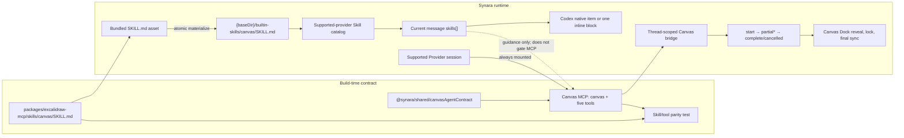

# Built-in Canvas Skill and MCP Contract - Plan

## Goal Capsule

- **Objective:** 把 Canvas 变成 Synara 内置、跨 Provider、按当前轮显式选择的 Agent Skill，并在同一次原子迁移中把 Agent 可见的 Canvas MCP 收敛为 `canvas` namespace 与 `read / begin / append / commit / cancel` 五个工具。
- **Execution profile:** Deep cross-interface change；依次完成共享契约、内置 Skill 分发、逐轮注入、MCP 迁移、Provider 配置、Canvas UI 状态和打包验证。
- **Authority order:** Product Contract 高于 Planning Contract；本轮 session-settled 决策高于实现便利；若实现需要引入通用 target 模型、恢复旧工具别名、扩展 Provider 支持或改变 Canvas 持久化模型，必须停止并重新确认范围。
- **Stop conditions:** 六个受支持 Provider 的 Skill 与 MCP 行为无法保持一致、打包后的 Skill 无法被外部 Agent 进程读取，或短工具名无法在不误判普通工具的前提下维持 Canvas 单写者保护时，停止并报告阻塞。
- **Tail ownership:** 实现执行者负责聚焦测试、跨 Provider parity、打包 smoke、文档同步和废弃代码清理；本计划不包含 PR 或发布动作。

---

## Product Contract

### Summary

Synara 提供一个名为 `/canvas` 的内置 Skill。用户在某一轮显式选择它时，Synara 只为该轮向当前 Provider 投射 Canvas 工作流指导；后续未选择 Skill 的消息不继承隐藏指令。Canvas MCP 继续随受支持 Provider 的会话常驻，因此未选择 `/canvas` 的后续追问仍可由 Agent 根据上下文自行判断是否继续使用 Canvas。

这次同时完成 Agent 可见 MCP 契约的破坏性收敛：server namespace 改为 `canvas`，显示身份改为 `Synara Canvas`，工具只保留 `read`、`begin`、`append`、`commit`、`cancel`。删除 `read_me` 和 `create_view`，使所有绘制都经过增量 preview，再执行一次原子保存。

### Problem Frame

当前 Canvas 能力只靠 MCP tool 描述被动发现。要让 Agent 稳定地选择正确绘图流程，用户需要在提示词中重复说明 Canvas、避免和 image generation 等能力混淆，并提醒 Agent 使用增量工具。另一方面，当前 MCP 暴露七个长名称和两条写入路径；`create_view` 会让模型倾向一次性提交，也让 Skill 与工具说明更容易漂移。

现有系统已经有逐消息 Skill 选择与跨 Provider 投射机制，因此问题不需要新的 target 抽象。真正需要补齐的是：一个由 Synara 管理的保留 Skill、按 Provider 能力过滤和投射、一个更短且唯一的增量 MCP 契约，以及不会被通用短动词误触发的 Canvas UI 状态判断。

### Actors

- A1. **用户：** 在 composer 中选择 `/canvas`、其他 Skill、多个 Skill，或不选择 Skill；同时可以在共享 Canvas 上手动编辑。
- A2. **受支持 Agent：** Codex、Claude Agent、Cursor、Gemini、Grok、Droid；获得会话级 Canvas MCP，并在当前轮获得所选 Skill 的原生或内联指导。
- A3. **Synara runtime：** 管理内置 Skill、规范化选中引用、配置 MCP、转发 preview、维护 Canvas 单写者状态，并打包同一份契约。

### Requirements

#### Skill discovery and turn semantics

- R1. `/canvas` 必须作为 Synara 管理的内置 Skill 出现在 Codex、Claude Agent、Cursor、Gemini、Grok 和 Droid 的 Skill picker 中；Kilo、OpenCode 和 Pi 不显示这个不可执行的内置项。
- R2. 内置 `canvas` 是保留名称；在受支持 Provider 中，它必须优先于 provider-native、个人或项目中同名的 Skill，同时 Settings 仍显示重复来源，并允许通过现有按名称禁用设置隐藏它。
- R3. picker 选择、手动输入、粘贴或 draft 恢复出的精确 `/canvas` token 都必须在发送边界解析为当前 Provider 的 managed Skill；unsupported 或 disabled 时保留草稿并给出明确不可用错误，不能把它静默当作普通文本发送。
- R4. `/canvas` 只影响当前消息及其同一意图的 retry、edit-resend；新建、排队或后续未包含 `/canvas` 的消息不得继承 Canvas Skill。
- R5. 用户当前轮显式选择其他 Skill 时，以当前轮选择为准；选择多个 Skill 时保留全部选择并交由 Agent 判断协作方式，不增加硬性工具 allowlist 或互斥规则。
- R6. Canvas MCP 必须继续随受支持 Provider 会话常驻，不因 `/canvas` 的选择而挂载或卸载；没有选中 Skill 的 Agent 仍可依据对话上下文和工具描述使用 Canvas。

#### Agent-facing Canvas contract

- R7. Agent 可见 MCP namespace 必须为 `canvas`，MCP 显示身份必须为 `Synara Canvas`，并且只注册 `read`、`begin`、`append`、`commit`、`cancel` 五个工具。
- R8. `read_me`、`read_scene`、`begin_view`、`append_view`、`commit_view`、`cancel_view`、`create_view` 全部从可调用面移除，不提供兼容别名。
- R9. 每次绘制必须遵循 `read → begin → append* → commit | cancel`；非空绘制至少产生一个用户可见的 partial preview，`commit` 只执行一次 revision-checked 原子保存，`cancel` 不改变已保存 Drawing。
- R10. `SKILL.md` 是详细行为指导；MCP server `instructions` 是未选择 Skill 时的简洁 fallback；每个 tool description 自身说明前置状态与下一步。任一客户端不显示其中一层时，剩余层仍足以正确调用五工具流程。
- R11. Skill 必须说明何时使用可编辑 Canvas、何时询问结构性澄清问题、如何使用小语义批次和 camera updates、如何保留未要求修改的元素，以及如何与当前轮其他 Skill 协作而不替 Agent 做硬路由。

#### Runtime, UI, and packaging integrity

- R12. Canvas namespace、工具名、mutation 工具集合和内置 Skill 名称必须由共享 Agent contract 定义；静态 `SKILL.md` 与注册工具之间必须有 parity 测试，防止一边改名而另一边漂移。
- R13. Canvas Dock 以 preview 生命周期作为自动 reveal、绘制中锁定和最终同步的主信号；tool activity 只能使用带 `canvas` namespace 边界的精确身份作为 fallback，不能匹配裸 `read`、`begin`、`append`、`commit` 或 `cancel`。
- R14. 内置 Skill 必须在 Bun 开发、Node server bundle 和 Electron/DMG 中可用。Synara 启动时把打包资产原子刷新到真实磁盘上的 managed root，Codex 注册该 root，其他 Provider 从同一路径读取或内联。
- R15. managed Skill 写入失败时，系统不得发布一个不可读的 `/canvas` descriptor 或静默丢失已选 Skill；发现阶段记录清晰诊断并降级为 MCP-only，已选 Skill 的发送阶段返回可操作错误。

### Key Flows

- F1. **显式 Canvas 轮次：** 用户从 picker 选择、输入或粘贴 `/canvas` 并发送绘图请求；Synara 在发送时解析到当前 managed descriptor，Codex 收到结构化 Skill item，其他受支持 Provider 收到一次内联 Skill；Agent 使用常驻 `canvas` MCP 逐批绘制并保存。
- F2. **未标记的连续追问：** F1 完成后用户发送未选择 Skill 的追问；新消息不携带 Canvas Skill，但 MCP 仍在会话中，Agent可根据上下文继续 Canvas 或使用普通能力。
- F3. **当前轮其他或多个 Skill：** 用户只选择 image generation 等其他 Skill 时，不注入 Canvas；同时选择 `/canvas` 与其他 Skill 时，两者都投射一次，Agent自行组合或选择。
- F4. **隐式 Canvas 使用：** 用户未选择 `/canvas`，但 Agent判断应修改共享 Drawing；MCP instructions 和 tool descriptions 能独立引导 `read → begin → append* → commit | cancel`。
- F5. **取消、冲突和 preview 失败：** 取消或 revision conflict 保留最后保存版本；preview transport 失败不阻止原子保存，但返回 `previewDelivered: false`，Drawing change 通知仍使 UI 收敛到权威 scene。
- F6. **升级后的新会话：** 应用升级或开发重启刷新 managed Skill 并启动新 Provider session；新 namespace 生效，旧的运行中 session 不继续使用已删除工具。
- F7. **发送前切换 Provider：** supported→supported 时，保留可见 `/canvas` token 并重新绑定目标 Provider 的 managed descriptor；切到 unsupported 或已禁用状态时，token 保留在草稿中并显示不可用原因，用户修改后再发送。

### Acceptance Examples

- AE1. 在 Codex 轮次输入 `/canvas 画一个 TCP/IP 分层图`，发送记录只包含本轮的 Canvas Skill，Agent 调用 `canvas` 下的五个短工具，并且用户在最终保存前看到至少两个 append batch 的中间结果。
- AE2. AE1 后发送“把标题再简洁一点”且不选择任何 Skill；该消息的 `skills` 为空，没有 Canvas prompt 注入，但 Agent仍可根据上下文使用常驻 MCP。
- AE3. 当前轮只选择 image generation Skill 时，即使上一轮使用过 `/canvas`，本轮不注入 Canvas；同时选择两个 Skill 时，两份指导各出现一次且没有工具级硬过滤。
- AE4. Provider-native 目录存在另一个名为 `canvas` 的 Skill 时，受支持 Provider 的 picker 和发送阶段仍解析到 Synara managed `canvas`；Settings 展示两个来源，禁用 `canvas` 后内置项不再出现在 picker。
- AE5. 一个普通 Git 工具活动摘要包含 “commit”，或其他工具名为 `append`；Canvas 不自动打开、不锁定，也不触发 final sync。`mcp__canvas__begin` 或等价的带 namespace 结构化身份才可作为 fallback。
- AE6. `append` 的第二批 preview 到达后 `commit` 遇到 revision conflict；UI 已显示的 preview 被取消并回到权威 scene，bridge 没有成功保存，用户的已保存 Drawing 不被覆盖。
- AE7. 打包产物在不依赖 monorepo 路径的临时目录启动时，能 materialize 完整 `SKILL.md`，列出 namespace `canvas` 的五个工具，并且不列出任何旧工具名。
- AE8. 用户手动粘贴 `/canvas 画架构图` 后直接发送，效果与 picker 选择相同；发送前从 Codex 切到 Claude Agent 会重新绑定，切到 OpenCode 则保留草稿并提示该 Provider 不支持内置 Canvas Skill。

### Success Criteria

- 六个受支持 Provider 对 `/canvas` 的发现、当前轮投射和常驻 MCP 行为一致；三个不支持 Provider 不暴露内置 Canvas Skill。
- picker、手动输入、粘贴、draft 恢复和 supported Provider 切换都能可靠解析当前 `/canvas`；unsupported/disabled 不会静默退化为普通文本。
- Agent 面只剩一个增量 mutation 路径；所有非空绘制在 commit 前产生 partial preview，保存次数为一次。
- 新短工具名不会让无关活动触发 Canvas reveal、锁定或 final sync。
- Bun、server bundle 与桌面打包产物均携带并刷新同一份 Canvas Skill；开发源、managed 副本和 MCP 注册名有自动一致性证明。

### Scope Boundaries

#### In Scope

- 内置 `/canvas` Skill 的内容、managed 分发、保留名优先级、Settings 展示与现有禁用行为。
- 六个现有 Canvas MCP Provider 的原生/内联 Skill 投射与当前轮语义。
- Agent 可见 MCP namespace、显示身份、五工具注册、增量 preview、Canvas UI fallback 识别和打包验证。
- 删除 one-shot replay 路径及其死代码、测试和 UPSTREAM 说明。

#### Out of Scope

- 新建通用 `target` schema、`@canvas` alias、sticky session target 或自动记忆上一轮 Skill。
- 为 Kilo、OpenCode、Pi 增加 Canvas MCP。
- 改名 `@synara/excalidraw-mcp` package、`synara-excalidraw-mcp` executable、环境变量或内部 Excalidraw scene 类型。
- 改变 Drawing 的 thread-scoped 存储、revision 规则、手动 Canvas 编辑或 Drawing 删除生命周期。

#### Deferred to Follow-Up Work

- 将 `append` 的 `elements` JSON-string 参数重命名为结构化 `operations` 数组；这会扩大已经确认的工具名迁移面，本计划保持参数 schema 不变。
- 为 `begin` 增加或强制 `expectedRevision`；当前继续由 `begin` 读取 base revision，并由 `commit` 做 revision-checked 保存。
- 把 Canvas 之外的其他输出能力做成新的内置 Skill，或引入通用 target 优先级系统。
- 实现完成后，将“跨 Provider 内置 Skill 与 MCP 契约同步演进”沉淀到 `docs/solutions/`；当前仓库尚无该类 durable learning。

### Dependencies

- `@modelcontextprotocol/sdk` 1.25.2 的 `McpServer` instructions 能力。
- 现有 per-message `skills` / `mentions` contract、composer slash skill 解析和 Provider Skill 投射链路。
- 现有 thread-scoped Canvas bridge、preview replay、Drawing revision 和六 Provider 支持矩阵。

---

## Planning Contract

### Key Technical Decisions

- KTD1. **使用内置跨 Provider Skill，不新增 target 抽象。** 复用现有 `/skill` 发现、每消息引用和 Provider 投射链路，`canvas` 只增加一个受管理来源与保留名规则。 (session-settled: user-approved — chosen over a first-class target framework: the existing per-turn Skill pipeline already matches the requested semantics with less new state)
- KTD2. **`/canvas` 是当前轮、非 sticky 的显式指导。** picker、输入、粘贴和恢复草稿中的精确 token 都在发送边界绑定；retry 和 edit-resend 保留原消息选择，因为它们仍是同一用户意图；新消息和独立 queued follow-up 只携带各自选择。 (session-settled: user-directed — chosen over session-level carry-over: every new turn must honor only its current explicit selections)
- KTD3. **Skill 指导 Agent 判断，不实施互斥工具路由。** 多个当前轮 Skill 均被保留；如果当前轮只选了其他 Skill，不从历史恢复 Canvas。 (session-settled: user-directed — chosen over a hard Canvas allowlist or exclusive target: the Agent should resolve capability overlap from the current request)
- KTD4. **Skill 与 MCP 契约在同一原子迁移中落地。** 不先发布引用旧工具的 Skill，也不先改 MCP 再留下失效 Skill。 (session-settled: user-directed — chosen over deferring the MCP rename: a later rename would immediately force another Skill migration and create drift)
- KTD5. **Agent 面一次性切换为 `canvas` 与五个短工具，不保留旧别名。** 唯一 mutation 流程是 `read → begin → append* → commit | cancel`，`create_view` 的 replay fallback 被删除。 (session-settled: user-approved — chosen over long names, aliases, and dual mutation paths: one concise incremental contract keeps preview visible and lowers Agent ambiguity)
- KTD6. **只向已有 Canvas MCP 的六个 Provider提供内置 Skill。** Kilo、OpenCode、Pi 继续支持手动 Canvas，但不显示不可执行的 `/canvas`。 (session-settled: user-approved — chosen over advertising the Skill to every provider: the Skill must not promise tools the active provider does not have)
- KTD7. **Skill 源文件归 Canvas MCP package，运行副本归 Synara managed root。** canonical source 放在 `packages/excalidraw-mcp/skills/canvas/SKILL.md`；构建时复制到 package/server dist，运行时通过临时文件加 rename 原子刷新到 `{baseDir}/builtin-skills/canvas/SKILL.md`。独立 root 避免覆盖用户的 `{baseDir}/skills`，也让 Codex 外部进程能够读取 Electron/asar 外的真实文件。
- KTD8. **`canvas` 是保留名，但仍服从现有 disable 设置。** supported provider 的 merge 先放 managed built-in，再合并 native/catalog；发送前按当前 prompt token 把任何 `canvas` 引用规范化为当前 managed path。Settings 使用 `synara-builtin` scope 展示来源，现有 `skills.disabled` 过滤最终决定是否可选；unsupported/disabled token 阻止发送并保留草稿。
- KTD9. **共享代码只承载稳定 Agent 标识，详细 Skill 仍以 Markdown 为源。** 新增 `@synara/shared/canvasAgentContract`，集中 Skill 名、MCP namespace、显示名、五工具名和 mutation 集合；MCP 注册、Provider 配置和 web identity helper 复用它。parity 测试读取 `SKILL.md`，证明文档只引用最终工具且没有旧名。
- KTD10. **preview lifecycle 是 Canvas UI 的主事实源。** `start/partial` 驱动 reveal 和锁定，`complete/cancelled` 结束 preview，Drawing change 与 settled sync 收敛权威 scene。activity fallback 只接受带 `canvas` namespace 边界的已知 Provider 形态；裸短动词永远不是 Canvas 证据。
- KTD11. **MCP instructions、tool descriptions 与 Skill 分层而非复制全文。** Skill 保存高层判断和绘图质量规则；server instructions 提供条件式五步流程；每个 description 提供本工具的局部前置条件、状态影响和下一步。删除 `read_me` 后，未显式选择 Skill 的 Agent 仍可通过 MCP 自发现。
- KTD12. **内部 package/bin 与 tool 参数 schema 保持不变。** `@synara/excalidraw-mcp`、`synara-excalidraw-mcp`、bridge 环境变量和 `append.elements` 不影响模型看到的短工具名；本轮不扩大到发布身份或 operation schema 迁移。

### High-Level Technical Design

### State and Precedence Rules

1. Provider 不支持 Canvas MCP：不注入 built-in descriptor；其他同名用户 Skill 仍按普通 Skill 规则处理。
2. Provider 支持 Canvas MCP：managed built-in `canvas` 在名称去重前置顶；用户/Provider 同名副本只能作为 Settings 来源显示。
3. 当前消息包含精确 `/canvas`：发送阶段从当前 Provider catalog 解析并重写为 managed path，防止手动输入未绑定、旧 draft、home-dir 变化或伪造路径绕过内置契约。
4. 当前消息不包含 `/canvas`：不添加 Canvas Skill；不读取上一轮选择。MCP 仍留在会话中。
5. 当前消息选中多个 Skill：保持数组和当前文本语义；Canvas 只增加自己的指导，不删减其他 Skill 或 Provider 工具。
6. Provider 切换：不删除可见 token；发送阶段用新 Provider catalog 重绑定。新 Provider 不支持或 Skill 已禁用时，保留草稿并返回明确错误。

### MCP Lifecycle Invariants

| State | Allowed call | Observable effect | Saved Drawing |
|---|---|---|---|
| Idle | `read` | 返回当前 editable scene 与 revision metadata | 不变 |
| Idle | `begin` | 取消遗留 preview，读取最新 base，发出 `start` | 不变 |
| Preview active | `append` | 串行应用一个小批次，递增 sequence，立即发出 `partial` | 不变 |
| Preview active | `commit` | revision-checked 保存一次，发出 `complete`，清理 active preview | 更新一次 |
| Preview active | `cancel` | 发出 `cancelled`，恢复权威 scene，清理 active preview | 不变 |
| Invalid order | `append/commit/cancel` | 返回明确 tool error | 不变 |
| Commit conflict | `commit` | 发出取消语义并返回 conflict error | 不变 |
| Preview transport failure | 任意 preview phase | 标记 `previewDelivered: false`，保存路径继续 | 只在成功 commit 时更新 |

### System-Wide Impact

- **Agent context:** Codex 使用 native Skill item 和注册的 managed root；Claude Agent、Cursor、Gemini、Grok、Droid 读取同一文件并按现有规则内联一次。MCP instructions 必须是“when using Canvas”的条件式说明，不能成为默认偏好 Canvas 的常驻 prompt。
- **Public tool surface:** tool IDs 和 server namespace 是模型与 Provider session 的外部契约。旧 session 在运行时不会自动重协商，开发热更新后必须重启 session；桌面升级会自然重启 backend/provider。
- **Shared workspace:** 用户与 Agent 继续编辑同一 Drawing。preview lock 是协作保护，不是数据所有权；最终写入仍靠 revision check 保证正确性。
- **Packaging:** Electron 包内路径不能作为外部 Agent 的可靠 Skill path，因此 dist asset 与 managed real-disk copy 都是必需的。managed 文件由 Synara 覆盖更新，用户内容继续只存在 `{baseDir}/skills`。
- **Settings:** 新的 `synara-builtin` 只影响来源标签和优先级，不新增 settings schema；按名称 disable 的现有持久化语义保持。
- **Historical data:** 旧 transcript/activity 可以继续显示，不做事件或 Drawing 数据迁移；只有新 tool calls 使用新契约。

### Risks and Mitigations

| Risk | Impact | Mitigation |
|---|---|---|
| provider-native `canvas` 覆盖内置 Skill | 不同 Provider 获得不同提示词 | 保留名优先级、发送前 path canonicalization、collision parity tests |
| Skill 只存在 app.asar 或 monorepo | Codex 忽略/读不到 Skill | dist asset + real-disk atomic materialization + packaged path smoke |
| 短工具名触发 substring false positive | Canvas 被普通工具误锁或错误 final sync | preview-first；fallback 必须有 `canvas` namespace 边界；裸动词负面测试 |
| MCP instructions 未被某 ACP host 展示 | 未选择 Skill 时 Agent 不会正确调用 | 每个 tool description 自包含局部 workflow，六 Provider smoke 验证 |
| 旧 session 仍缓存旧工具 | 升级后调用 unknown tool | 不加 alias；变更后重启 active Provider session；错误保持明确 |
| 删除 `create_view` 后 Agent 试图一次 append 全图 | 用户仍看不到有意义的过程 | Skill 和 descriptions 要求 3–8 个元素的小语义批次；MCP/browser 测试观察多次 partial |
| preview transport 失败时 UI 未锁定 | 用户与 Agent 可能并发编辑 | revision conflict 仍保护 Drawing；drawing-change 收敛最终 scene；namespaced activity fallback 提供额外锁定 |
| managed 写入失败或部分更新 | picker 指向不可读文件 | temp + rename；失败时 catalog omission + warning；已选 turn clear error，不静默跳过 |

### Sources and Research

- `docs/plans/2026-07-15-001-refactor-session-canvas-artifact-plan.md`：KTD4 固定六 Provider 支持矩阵；KTD5 记录当前无 Canvas prompt 注入的基线；KTD8 已将 preview start 定义为跨 Provider reveal 信号。
- `apps/server/src/provider/skillsCatalog.ts`、`apps/server/src/provider/Layers/ProviderDiscoveryService.ts`：现有 catalog、provider-native 优先级、disabled filtering 和跨 Provider discovery。
- `apps/server/src/provider/skillPromptInjection.ts`、`apps/server/src/codexAppServerManager.ts`：fallback inline 与 Codex `skills/extraRoots/set` 的当前边界。
- `packages/excalidraw-mcp/src/server.ts`、`apps/server/src/provider/providerCanvasRuntime.ts`：当前七工具、one-shot replay、MCP namespace 和 session 配置。
- `apps/web/src/lib/canvasAgentState.ts`、`apps/web/src/components/CanvasDockPane.tsx`：当前 distinctive-name substring fallback 与 preview/final-sync 生命周期。
- `packages/shared/src/canvasProvider.ts`：Canvas MCP 的唯一 Provider 支持矩阵。

---

## Implementation Units

### U1. Define the shared Agent contract and managed Skill asset

**Goal:** 建立一个可被 MCP、server 和 web 共同引用的 Canvas Agent 标识契约，并把符合 Agent Skills 规范的 `SKILL.md` 安全物化到 Synara managed root。

**Requirements:** R11, R12, R14, R15; F6; AE7.

**Dependencies:** None.

**Files:**

- Create `packages/shared/src/canvasAgentContract.ts`
- Modify `packages/shared/package.json`
- Create `packages/excalidraw-mcp/skills/canvas/SKILL.md`
- Create `packages/excalidraw-mcp/scripts/copySkillAssets.ts`
- Modify `packages/excalidraw-mcp/package.json`
- Modify `packages/excalidraw-mcp/src/bundleConfig.test.ts`
- Create `apps/server/src/provider/builtinCanvasSkill.ts`
- Create `apps/server/src/provider/builtinCanvasSkill.test.ts`

**Approach:**

- Export immutable constants for Skill name `canvas`, namespace `canvas`, display identity `Synara Canvas`, exact five tool names and the mutation subset. Keep this runtime-only module in `packages/shared`, not `packages/contracts`.
- Author a concise `SKILL.md` with only `name` and `description` frontmatter plus high-level judgment, collaboration and incremental drawing instructions. Reference final tool names, `elements` JSON operations, camera/delete pseudo-elements and revision-safe commit/cancel behavior; do not duplicate low-level implementation prose.
- Extend the MCP package build to copy `skills/canvas/SKILL.md` into `dist/skills/canvas/SKILL.md`; export the asset-copy helper so bundle tests exercise the same logic as the build script.
- Resolve the canonical asset from package source under Bun and from `dist/excalidraw-mcp/skills` under packaged Node. Atomically refresh `{baseDir}/builtin-skills/canvas/SKILL.md` only when content differs; a temp file and same-directory rename prevents partial reads.
- Return a descriptor/path only after a readable file exists. Treat the managed directory as Synara-owned and never scan it as user-authored `synara` scope.

**Patterns to follow:** Explicit `@synara/shared/*` subpath exports; `ensureSynaraSkillsDir` filesystem error posture; existing Canvas MCP source/bundled entry resolver in `ProviderCommandReactor`.

**Test scenarios:**

- Materializing into an empty base dir creates the exact managed path and valid `name: canvas` frontmatter.
- Re-running with unchanged content is idempotent; changing the bundled content replaces the file atomically without leaving temp files.
- A simulated write/read failure returns no usable descriptor and preserves any last complete managed file.
- The MCP package build output contains the Skill asset and can locate it from an unrelated working directory.
- Covers AE7. Source Skill, copied dist asset and managed copy have identical content/hash.

**Verification:** Shared consumers import one contract; the canonical Skill exists as Markdown in source and as a readable managed file in development and bundled layouts.

### U2. Reserve and discover `/canvas` for supported Providers

**Goal:** 将 managed Canvas descriptor 接入统一 catalog、Settings 和 Codex roots，并以现有 Provider 支持矩阵控制可见性。

**Requirements:** R1, R2, R6, R14, R15; F1, F6, F7; AE4, AE7, AE8.

**Dependencies:** U1.

**Files:**

- Modify `apps/server/src/provider/skillsCatalog.ts`
- Modify `apps/server/src/provider/skillsCatalog.test.ts`
- Modify `apps/server/src/provider/Layers/ProviderDiscoveryService.ts`
- Modify `apps/server/src/provider/Layers/ProviderDiscoveryService.test.ts`
- Modify `apps/server/src/wsRpc.ts`
- Modify `apps/server/src/codexAppServerManager.ts`
- Modify `apps/server/src/codexAppServerManager.test.ts`
- Modify `apps/server/src/provider/Layers/CodexAdapter.ts`
- Modify `apps/web/src/components/settings/skillsSettingsModel.ts`
- Modify `apps/web/src/components/settings/skillsSettingsModel.test.ts`
- Modify `apps/web/src/hooks/useComposerCommandMenuItems.ts`
- Create `apps/web/src/hooks/useComposerCommandMenuItems.test.ts`

**Approach:**

- Add `synara-builtin` as a dedicated catalog origin backed by `{baseDir}/builtin-skills`, separate from personal Synara skills.
- For providerless Settings discovery, include the built-in source and duplicate origins. For provider list discovery, add it only when `isCanvasProviderSupported(provider)` is true.
- Change name dedupe/merge so the managed descriptor wins only for the reserved normalized name `canvas`; all other Skill precedence remains provider-native-first.
- Apply existing `filterDisabledSkills` after reserved merge, so disabled `canvas` disappears from picker without a new settings field.
- Register both personal and built-in roots through Codex `skills/extraRoots/set`. If the Codex version does not support extra roots, preserve the existing warning/fallback posture.
- Label the new scope “Built into Synara” and keep duplicate provider/user copies visible as sources in the same Settings group.
- When built-in Canvas is available, reserve the `/canvas` command-menu token for the Skill and suppress a conflicting provider-native slash command; other command/Skill ranking stays unchanged.

**Patterns to follow:** `SkillsCatalogDiscoveryInput`, deterministic root ordering/cache keys, duplicate-origin Settings grouping, `packages/shared/src/canvasProvider.ts` as the sole capability predicate.

**Test scenarios:**

- Each supported Provider lists one built-in Canvas descriptor with the managed path; Kilo/OpenCode/Pi omit only the built-in while still listing unrelated or user-defined skills.
- Covers AE4. A provider-native and project `canvas` cannot replace the built-in for supported Providers, but all sources remain visible in Settings.
- Disabling normalized name `canvas` removes it from supported Provider results; re-enabling restores it.
- Materialization failure logs/degrades without returning an unreadable descriptor or hiding unrelated skills.
- Codex registers both roots exactly once per session and tolerates the existing unsupported-extra-roots error.
- Cache keys/results do not leak built-in Canvas visibility from a supported Provider lookup into an unsupported one.
- A provider-native slash command named `canvas` cannot outrank or duplicate the built-in Skill item on supported Providers.

**Verification:** Picker and Settings use the correct scope and precedence; Codex can natively load the same real-disk file returned by discovery.

### U3. Enforce current-turn Skill projection and canonical references

**Goal:** 保证 `/canvas` 仅随当前消息投射、跨 Provider恰好一次，并在发送边界把保留名称解析为当前 managed 文件。

**Requirements:** R3, R4, R5, R6, R15; F1, F2, F3, F7; AE1, AE2, AE3, AE4, AE8.

**Dependencies:** U1, U2.

**Files:**

- Modify `apps/server/src/orchestration/Layers/ProviderCommandReactor.ts`
- Modify `apps/server/src/orchestration/Layers/ProviderCommandReactor.skillMentions.test.ts`
- Modify `apps/server/src/orchestration/Layers/ProviderCommandReactor.test.ts`
- Modify `apps/server/src/provider/skillPromptInjection.ts`
- Modify `apps/server/src/provider/skillPromptInjection.test.ts`
- Modify `apps/server/src/provider/Layers/CodexAdapter.test.ts`
- Modify `apps/server/src/provider/Layers/ClaudeAdapter.test.ts`
- Modify `apps/web/src/lib/composerMentions.ts`
- Modify `apps/web/src/lib/composerMentions.test.ts`
- Modify `apps/web/src/components/ChatView.tsx`
- Modify `apps/web/src/components/ChatView.browser.tsx`

**Approach:**

- Resolve exact current-prompt Skill tokens against the active Provider catalog at send/queue time rather than trusting only picker callbacks. Keep the resolver generic for normal Skills, but reserve `canvas` so it never trusts an existing client path.
- At turn dispatch, detect normalized name `canvas` only for supported Providers and replace its client/persisted path with the current managed descriptor. Preserve array order and every non-Canvas Skill reference.
- Keep Codex `/canvas` to `$canvas` text normalization plus native structured Skill item. Treat the managed built-in root as native for Codex.
- Inline the managed Skill for Claude Agent, Cursor, Gemini, Grok and Droid through the existing fallback, once per selected Skill. The managed path lives below `.synara`, so Cursor must treat it as Synara-owned rather than provider-native.
- Do not add thread/session Canvas Skill state. Fresh sends and queued messages resolve their own prompt tokens; retry/edit-resend preserve the original message’s selection.
- Stop clearing visible Skill intent on supported Provider changes. Re-resolve `/canvas` when the new catalog is ready; when unsupported/disabled, keep the prompt and surface a send-time error instead of silently dispatching plain text.
- If an explicitly selected built-in cannot be materialized/read, fail the turn with a clear provider-dispatch error instead of silently removing the Skill block. Unselected turns continue with MCP-only behavior.

**Patterns to follow:** `normalizeSkillMentionTextForProvider`, `buildInlineSkillInstructions`, existing message/queued-turn Skill persistence and edit-resend behavior.

**Test scenarios:**

- Covers AE1. Codex receives `$canvas` plus one structured managed Skill item; each fallback Provider receives one inline block and no duplicate text.
- Covers AE2. A fresh untagged follow-up after a Canvas turn sends an empty Canvas Skill projection while retaining the session MCP config.
- Retry and edit-resend of the same Canvas message preserve the Skill; a separately queued follow-up without it stays untagged.
- Covers AE3. Selecting only another Skill does not restore Canvas; selecting Canvas plus another Skill preserves both in native/inline output.
- Covers AE4. A stale or provider-local `canvas` path is rewritten to the managed path; unrelated skills keep their original paths.
- Covers AE8. Picker selection, manual typing, paste and restored draft all produce the same managed reference at send time.
- Covers F7 / AE8. A supported→supported Provider switch rebinds Canvas; a supported→unsupported or disabled switch preserves the draft and blocks with a clear error.
- A missing managed file produces a clear send failure, while an unselected turn proceeds without Canvas Skill injection.

**Verification:** The wire input for every supported Provider proves current-turn-only semantics, exact-once injection and reserved-path canonicalization without new session state.

### U4. Replace the MCP surface with the five-tool incremental contract

**Goal:** 删除旧七工具和 one-shot replay，使 MCP server 只暴露新的 namespace-independent五工具增量生命周期。

**Requirements:** R7, R8, R9, R10, R11, R12; F1, F4, F5; AE1, AE6, AE7.

**Dependencies:** U1.

**Files:**

- Modify `packages/excalidraw-mcp/src/server.ts`
- Modify `packages/excalidraw-mcp/src/server.test.ts`
- Modify `packages/excalidraw-mcp/UPSTREAM.md`
- Modify `packages/excalidraw-mcp/package.json`

**Approach:**

- Construct the server as `Synara Canvas`, use the shared tool constants, and set concise conditional MCP `instructions` through the SDK constructor options.
- Rename current handlers to `read`, `begin`, `append`, `commit`, `cancel` without changing scene operation or `elements` input semantics.
- Delete `read_me`, `create_view`, replay batch constants, delay logic and helper functions. All writes now require an active preview.
- Keep serialized preview mutation ordering, checkpoint/restore operations, automatic cancellation of an abandoned active preview, best-effort preview delivery and one revision-checked save.
- Make every tool description explicit: `read` is read-only; `begin` starts without saving; `append` requires active preview and emits a semantic batch; `commit` saves once; `cancel` discards.
- Bump the private MCP/server contract version to `0.4.0-synara.1` while leaving package and executable names unchanged.

**Patterns to follow:** Existing `serializePreviewMutation`, `emitPreview`, `commitPreview`, bridge auth and `toolError` behavior.

**Test scenarios:**

- Initialization reports `Synara Canvas`, exposes non-empty instructions and lists exactly `read`, `begin`, `append`, `commit`, `cancel` in deterministic order.
- Every old tool call returns unknown-tool behavior; no old alias appears in list output, instructions, descriptions or Skill parity checks.
- Covers AE1. `begin` plus two `append` calls produces ordered `start, partial, partial`; bridge save count remains zero until `commit`, then becomes exactly one and ends with `complete`.
- `append`, `commit` and `cancel` without an active preview return errors and never save.
- Starting a new preview cancels the old stream before the new `start`; `cancel` restores the last saved scene.
- Covers AE6. A revision conflict during `commit` cancels preview semantics, reports an error and leaves saved scene/revision unchanged.
- Preview endpoint failure sets `previewDelivered: false`; `begin/append/commit` still performs exactly one successful atomic save.
- Malformed JSON, oversized input, invalid camera dimensions and missing checkpoints remain bounded errors.

**Verification:** MCP integration tests prove a single incremental mutation path, exact tool surface, ordered previews, failure safety and no dead replay code.

### U5. Rename the Provider MCP namespace atomically

**Goal:** 让六个 Provider session 使用共享 `canvas` server key，并确保新会话不再暴露 `synara-excalidraw`。

**Requirements:** R6, R7, R8, R12; F1, F4, F6; AE7.

**Dependencies:** U1, U4.

**Files:**

- Modify `apps/server/src/provider/providerCanvasRuntime.ts`
- Create `apps/server/src/provider/providerCanvasRuntime.test.ts`
- Modify `apps/server/src/codexAppServerManager.ts`
- Modify `apps/server/src/codexAppServerManager.test.ts`
- Modify `apps/server/src/provider/Layers/ClaudeAdapter.ts`
- Modify `apps/server/src/provider/Layers/ClaudeAdapter.test.ts`
- Modify `apps/server/src/provider/acp/AcpJsonRpcConnection.test.ts`
- Modify `apps/server/src/provider/acp/AcpNativeLogging.test.ts`
- Modify affected Cursor/Gemini/Grok/Droid adapter fixtures that assert MCP configuration

**Approach:**

- Replace `CANVAS_MCP_SERVER_NAME` ownership with the shared `CANVAS_MCP_NAMESPACE` constant; ACP and stdio helpers both emit `canvas`.
- Update Codex `mcp_servers` map, Claude `mcpServers` map and ACP session arrays in the same change. Keep command, args, bridge env vars and support matrix unchanged.
- Ensure session restart/recreation is the migration boundary. Do not dynamically mutate an active Provider session and do not add a second legacy server entry.
- Keep native logging and diagnostics showing the new namespace so support traces match Agent-visible tool identities.

**Patterns to follow:** `canvasAcpMcpServers`, `canvasStdioMcpServer`, Provider session startup in `ProviderCommandReactor`.

**Test scenarios:**

- ACP and stdio helpers emit exactly one server named `canvas` with unchanged command/args/env.
- Codex and Claude session configuration contain `canvas` and not `synara-excalidraw`.
- Cursor/Gemini/Grok/Droid session fixtures receive the same namespace through the shared ACP helper.
- Supported ordinary sessions continue receiving Canvas runtime; Kilo/OpenCode/Pi receive none.
- Recreating a session after the contract change yields only the new namespace; no alias or double server process is configured.

**Verification:** All six Provider configuration tests assert the same namespace and environment, with no model-visible old server name.

### U6. Make Canvas UI state safe for short tool names

**Goal:** 保留 preview 的可见中间过程、单写者锁和最终同步，同时消除裸短动词导致的误判。

**Requirements:** R9, R12, R13; F1, F5; AE1, AE5, AE6.

**Dependencies:** U1, U4, U5.

**Files:**

- Modify `apps/web/src/lib/canvasAgentState.ts`
- Modify `apps/web/src/lib/canvasAgentState.test.ts`
- Modify `apps/web/src/components/CanvasDockPane.tsx`
- Modify `apps/web/src/components/CanvasDockPane.browser.tsx`
- Modify central Canvas auto-reveal tests/fixtures if they encode old tool names

**Approach:**

- Make preview cursor/phase the primary `canvasLocked` and pending-final-sync evidence. Bind an accepted preview `start` to the current running turn so later `complete/cancelled` or turn settlement can finish the same sync lifecycle without relying on a generic tool summary.
- Replace old substring matching with a shared identity helper that requires both namespace `canvas` and a mutation tool name separated by a recognized Provider boundary or structured MCP metadata. Accept only shapes observed in current six Provider events; never infer from arbitrary output/detail text.
- Keep activity fallback for the short window before preview delivery and for best-effort preview transport failure. Historical old names may be recognized only as distinctive persisted activity identities, not registered as callable MCP aliases.
- Preserve requestAnimationFrame coalescing per preview event while ensuring separate append batches render on separate event turns; do not wait for `complete` before applying partial operations.
- On cancelled/conflicted previews, cancel pending render/camera frames and restore authoritative scene. On successful commit, drawing-change/final-sync converges to the saved revision without double-saving.

**Patterns to follow:** `canvasPreviewEventDecision`, `activePreviewCursorRef`, `pendingFinalReloadTurnIdRef`, KTD8 from the 2026-07-15 Canvas plan.

**Test scenarios:**

- Covers AE5. Structured/summary values containing bare `read`, `begin`, `append`, `commit`, `cancel`, “git commit” or ordinary cancellation never identify a Canvas mutation.
- Namespaced forms produced by Codex, Claude and ACP fixtures identify only `begin`, `append`, `commit`, `cancel`; namespaced `read` remains read-only and does not lock.
- Covers AE1. `start`, first partial and second partial visibly update the Excalidraw scene before complete; “AI is drawing” remains visible through interim assistant commentary.
- A preview start with no prior tool activity reveals/locks Canvas and schedules one final sync for the owning turn.
- Preview transport fallback activity locks Canvas without substring false positives; the later drawing-change event converges to the saved scene.
- Covers AE6. Cancel/conflict restores authoritative elements, clears lock and avoids a second save/final-sync loop.
- Interrupt or MCP process death during an active preview saves nothing; turn settlement clears the preview and restores the authoritative scene even without a terminal preview event.
- Duplicate, out-of-order, stale-base and cross-thread preview events remain ignored by the existing decision helper.

**Verification:** Browser and unit tests prove visible incremental rendering, precise short-name identification, conflict rollback and exactly-once settled sync.

### U7. Close packaging, parity, and rollout verification

**Goal:** 让源码、server bundle、桌面产物、文档和跨 Provider测试共同证明这次破坏性迁移可以完整交付。

**Requirements:** R7, R8, R10, R12, R14, R15; F6; AE7.

**Dependencies:** U1, U2, U3, U4, U5, U6.

**Files:**

- Modify `apps/server/scripts/cli.ts`
- Modify `scripts/build-desktop-artifact.ts` or the closest existing staged-asset assertion
- Modify `packages/excalidraw-mcp/src/bundleConfig.test.ts`
- Modify `packages/excalidraw-mcp/UPSTREAM.md`
- Modify any release/package manifest fixture that enumerates `dist/excalidraw-mcp`

**Approach:**

- Make server build/publish assertions require both `dist/excalidraw-mcp/main.mjs` and `dist/excalidraw-mcp/skills/canvas/SKILL.md` before copying or publishing.
- Extend desktop staging validation to prove the server dist carries the Skill source asset. Runtime materialization smoke must use an isolated base dir and must not depend on the developer home or monorepo.
- Add a parity test that imports shared constants, lists MCP tools, reads canonical `SKILL.md`, and rejects every old tool/namespace token. Keep detailed prose flexible while making names and workflow order exact.
- Update `UPSTREAM.md` to describe Synara’s five-tool preview-only fork and managed Skill; leave historical plans untouched.
- Document that development sessions must restart after the namespace migration. Desktop upgrades already restart backend/provider processes and require no data migration.

**Patterns to follow:** Existing Canvas MCP bundle smoke, server CLI asset assertions and desktop staged-server copy checks.

**Test scenarios:**

- Covers AE7. A clean MCP build emits executable entries plus Skill asset; a server build copies both into `apps/server/dist/excalidraw-mcp`.
- Publish/staging validation fails clearly when the Skill asset is missing, even if `main.mjs` exists.
- An isolated packaged-layout test materializes the Skill, discovers it for a supported Provider and starts the MCP without workspace dependencies.
- Parity scan finds exactly the five final names and no `read_me`, `*_view`, `create_view` or `synara-excalidraw` in active Agent contract surfaces.
- Existing Drawing files open unchanged after the new MCP/Skill contract; no persistence migration runs.

**Verification:** The same build artifact that launches Canvas MCP also supplies the managed Skill source, and release checks fail closed on contract drift or missing assets.

---

## Verification Contract

### Focused Automated Gates

| Surface | Command | Required proof |
|---|---|---|
| Shared contract | `bun run --cwd packages/shared test` | Agent identity helpers and namespace-safe matching remain deterministic. |
| Canvas MCP | `bun run --cwd packages/excalidraw-mcp test` | Exact five-tool surface, instructions, incremental preview, failure safety and asset build. |
| Server Skill/provider integration | `bun run --cwd apps/server test -- src/provider/skillsCatalog.test.ts src/provider/builtinCanvasSkill.test.ts src/provider/skillPromptInjection.test.ts src/provider/Layers/ProviderDiscoveryService.test.ts src/orchestration/Layers/ProviderCommandReactor.skillMentions.test.ts` | Discovery, reserved precedence, current-turn injection and managed path behavior. |
| Provider namespace | `bun run --cwd apps/server test -- src/provider/providerCanvasRuntime.test.ts src/codexAppServerManager.test.ts src/provider/acp/AcpJsonRpcConnection.test.ts src/provider/acp/AcpNativeLogging.test.ts` | Six Provider session configs use only `canvas`. |
| Web domain state | `bun run --cwd apps/web test -- src/lib/canvasAgentState.test.ts` | Bare short verbs cannot trigger Canvas; supported qualified forms can. |
| Browser Canvas flow | `bun run --cwd apps/web test:browser -- CanvasDockPane.browser.tsx` | Two partial batches render before commit; lock, cancel and final sync remain correct. |

### Integration and Packaging Gates

- Run the full server test package with `bun run test --filter=@synara/cli` after focused tests pass; this covers orchestration, Canvas bridge and all Provider adapter regressions.
- Run `bun run build:desktop` and verify `apps/server/dist/excalidraw-mcp/main.mjs` plus `apps/server/dist/excalidraw-mcp/skills/canvas/SKILL.md` exist before any DMG build.
- Launch an isolated server/home layout, list Skills for all nine Providers, invoke the five-tool MCP lifecycle, and verify managed Skill materialization without reading the developer’s real home.
- Run `bun run release:smoke` if implementation changes shared release/staging helpers rather than only localized server assertions.

### Repository Quality Gates

- Per repository policy, the final implementation cannot be considered complete until `bun fmt`, `bun lint`, and `bun typecheck` pass. Because these are heavyweight checks and require explicit user authorization in the active implementation conversation, run them once as the final bundled pass after obtaining that authorization.
- Never invoke `bun test`; all test execution uses `bun run test` or package-specific scripts.

### Manual Cross-Provider Matrix

1. For Codex, Claude Agent, Cursor, Gemini, Grok and Droid, confirm `/canvas` appears once, a selected turn receives the correct native/inline instructions, and an unselected follow-up receives none.
2. For Kilo, OpenCode and Pi, confirm the built-in `/canvas` is absent while manual Canvas still opens and edits normally.
3. In at least one native-Skill Provider and one inline-Skill Provider, request a non-trivial diagram and observe two or more visible semantic batches before the final scene.
4. Select another Skill after a Canvas turn and confirm there is no historical Canvas injection; select both and confirm both current-turn instructions survive.
5. Keep a Provider session running across a development rebuild, confirm the documented restart boundary, then restart and verify only namespace `canvas` is advertised.
6. Temporarily make the managed directory unwritable in an isolated home and confirm discovery/send diagnostics are explicit without corrupting the last complete Skill or Drawing.

---

## Definition of Done

### Global Completion Criteria

- Every requirement R1–R15 and acceptance example AE1–AE8 is covered by an implementation unit and observable verification.
- `/canvas` is a reserved, disable-able, supported-provider-only built-in Skill whose effect is current-turn only; no generic target or sticky state was introduced.
- Agent-visible Canvas MCP contains only namespace `canvas` and tools `read`, `begin`, `append`, `commit`, `cancel`; no legacy alias, `read_me` or one-shot mutation path remains.
- Skill source, shared identifiers, MCP registrations, Provider configs, web recognition and packaged assets pass parity checks.
- Multiple append batches render before commit, and unrelated short verbs cannot reveal, lock or sync Canvas.
- Development, server bundle and desktop staging use the managed real-disk Skill path without depending on a user-owned skill directory or monorepo checkout.
- Focused, full-package, integration and authorized repository quality gates pass; manual parity covers all supported and unsupported Provider groups.
- Abandoned replay helpers, duplicate name lists, obsolete comments, stale UPSTREAM claims, temporary files and experimental approaches are removed from the final diff.

### Per-Unit Completion

- U1: Shared identifiers, canonical Skill source, asset copy and atomic materializer exist with idempotence/failure tests.
- U2: Supported Provider discovery, reserved precedence, Settings source/disable behavior and Codex roots are correct.
- U3: Typed/pasted/restored token binding, Provider switching, current-turn native/inline projection, retry/edit semantics, multiple Skills and managed path canonicalization are proven.
- U4: Five-tool MCP lifecycle replaces all old registrations and preserves preview/save correctness under failure.
- U5: Every supported Provider session config uses only the `canvas` namespace and the restart boundary is documented.
- U6: Preview-first Canvas state and namespace-safe activity fallback preserve visible partials, locking, cancellation and final sync.
- U7: Server/desktop packaging, parity checks, rollout notes and upstream fork documentation fail closed on missing or stale contract assets.
